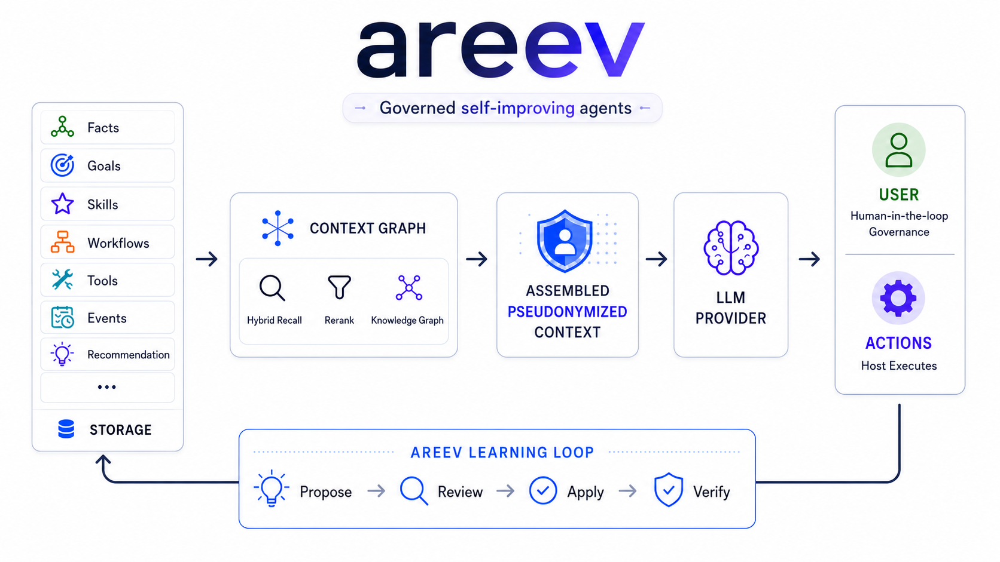
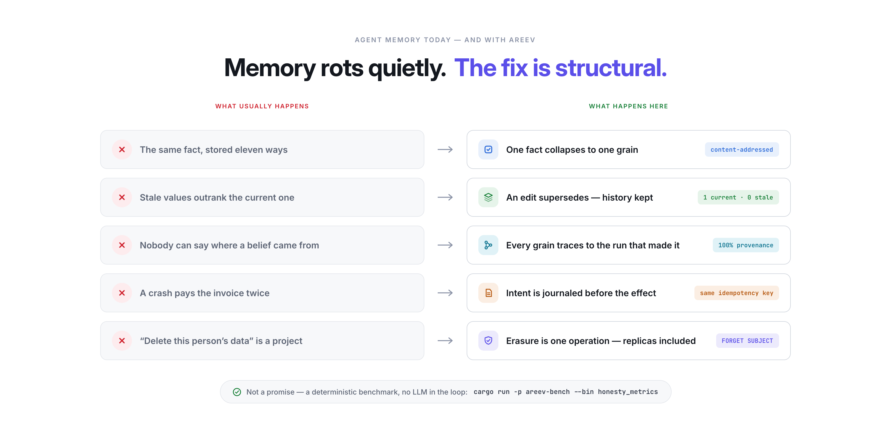
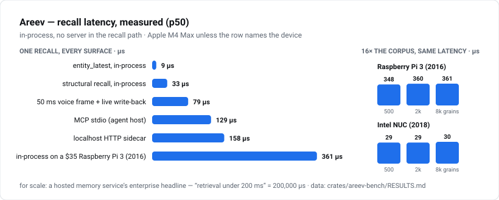
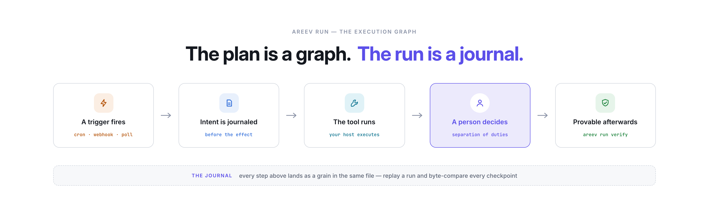
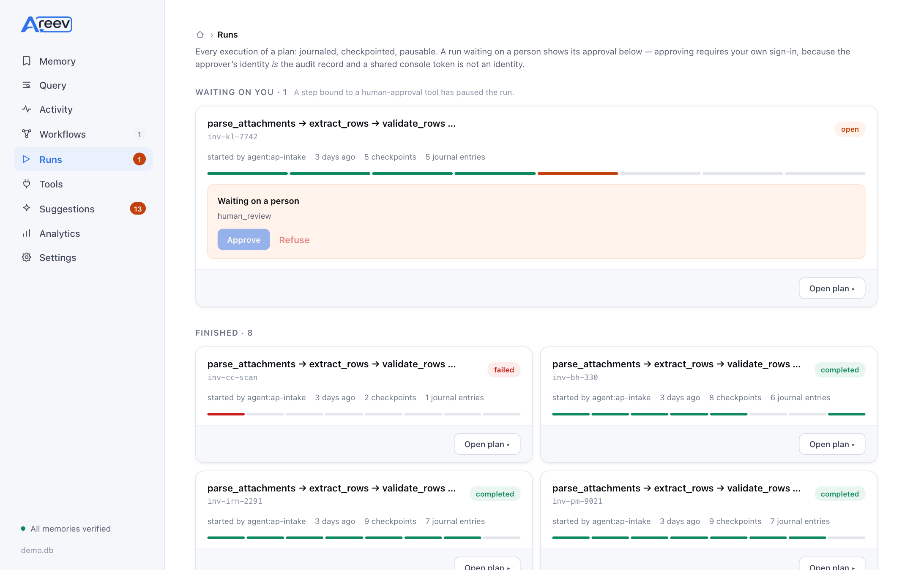
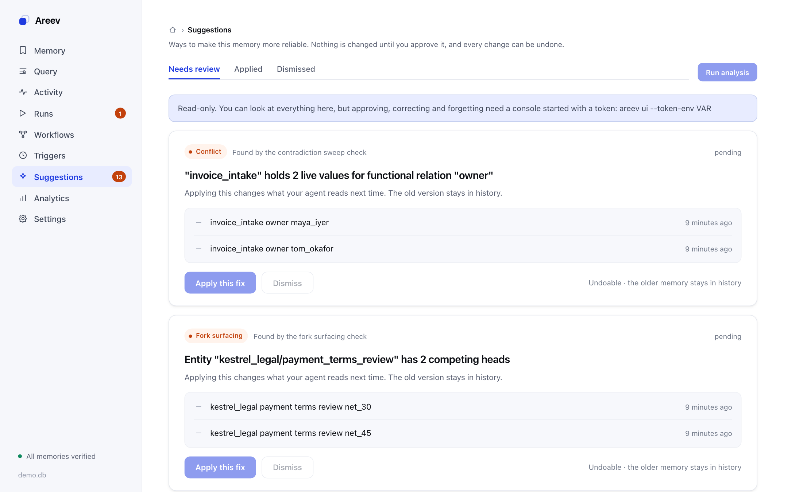
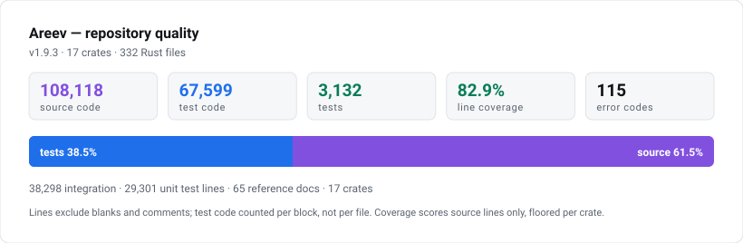
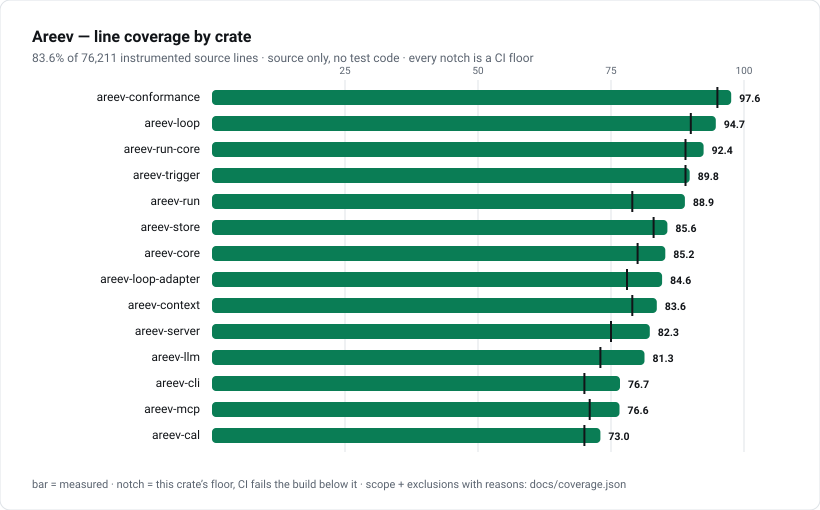
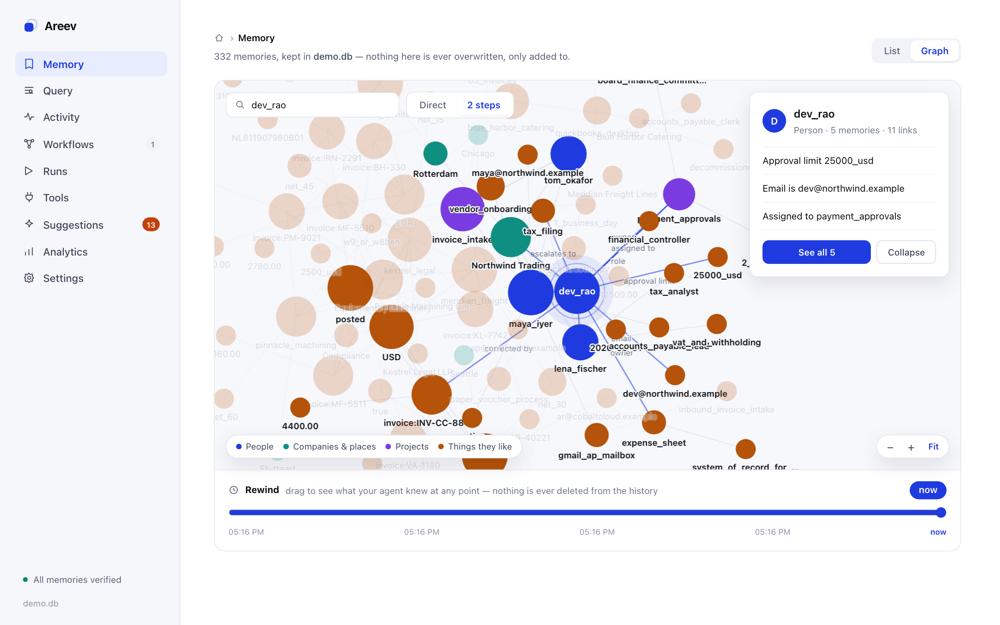

# Areev

**Self-improving agents, governed.** Areev is the substrate for **adaptive
agents** — agents that get better from their own history, under human
authority, in steps you can inspect, undo, and re-measure.

[](https://github.com/AreevAI/areev/actions/workflows/ci.yml)
[](#license)
[](#getting-started)

<p align="center">
  
</p>

<p align="center">
  <em>One substrate: typed grains in, a budget-shaped pseudonymized context out, a person on the gate —<br>
  and what the agent did comes back as the evidence its next improvement is proposed from.</em>
</p>

Every team that ships an agent wants the same next thing: an agent that
**gets better from its own experience**. Almost none ship one, because the
hard part is not the learning — it is four production problems that model
quality cannot solve:

**Trust.** An agent that rewrites its own instructions, memory, or tools
unsupervised is undeployable in any serious environment — not because it
won't improve, but because when it does, nobody can say what changed, or
why. "The agent learned" is not an answer a security review, an auditor,
or the [EU AI Act](docs/eu-ai-act.md) accepts.

**Evidence.** Improvement has to be learned *from* something. In most
stacks the agent's history is scattered across a vector store, a tracing
SaaS, and application logs — three systems, three lifecycles, no shared
identity. A proposal built on evidence you cannot cite is a guess with
confidence attached.

**Blast radius.** A change that helps this week can regress next week on
different inputs. Without a stored inverse and a scheduled re-measurement,
every improvement is a one-way door — so careful teams rationally refuse
them all, and the agent stays frozen at day-one behavior.

**Authority.** When a change does land, someone approved it — or nobody
did. If the system cannot name the approver, their written reason, and the
exact change applied, the audit trail is a Slack thread.

Areev turns these four from policy documents into mechanics. Improvement
becomes an **operation with a gate on it**: the agent proposes from its own
recorded history, citing its evidence by hash; a named person disposes,
with a written reason; every apply stores its inverse; and the system
re-measures afterwards whether the change actually helped — a late
regression proposes its own revert. The gate is enforceable rather than
aspirational because the agent's knowledge *and* its execution history
live in one content-addressed substrate, queried with a real query
language ([CAL](docs/cal-reference.md)) — one place that answers both
questions a serious deployment asks: **what should this agent recall right
now?** and **what did it do, on whose authority, and can we take it back?**

Three honest limits, because they are the reason this is deployable: it
improves the agent's **memory, never model weights** (Areev ships no trainer);
**nothing applies itself** — auto-apply is off unless a host policy grants it,
and never for destructive or LLM-originated changes; and **there is no
daemon** — everything runs when you run it. Autonomy is never earned by a
metric; it stays an explicit grant from the host.
[The full argument →](docs/why-areev.md)

---

## Five ways agent memory rots

<p align="center">
  
</p>

Vector-store memory fails quietly — duplicates crowd the prompt, stale values
outrank current ones, provenance is a log grep, a crash pays twice, and
erasure is a project. Areev makes each failure structurally impossible, and
proves it with a deterministic benchmark, no LLM in the loop:
`cargo run -p areev-bench --bin honesty_metrics`.
[Each failure, in detail →](docs/why-areev.md#the-problem)

---

## Sixty seconds

An accounts-payable agent, no credentials, no network, no model key:

```bash
cargo install areev
git clone https://github.com/AreevAI/areev && cd areev/examples/agents/invoice-to-accounting
./smoke.sh        # week one — it does the job, under governance
```

Small invoices post themselves; one over the threshold **parks for a person**
(the starter cannot approve its own run); a scanned page **fails loudly**
instead of posting a blank row. Then week two:

```bash
./improve.sh      # week two — it proposes its own fix, you decide
```

```
loop: ran — proposed 1 (0 deduped, 0 auto-applied) across 11 analyzer(s)
   HIGH  Workflow fc991baf5ead failed 4/8 recent runs (50%): parse_attachments:
         pdftotext produced 0 characters - attachment is a scanned image
   origin     builtin — deterministic, no model was called
   the engine cannot execute its own advice — it is advisory (LOP-E011)
approved 776d33d9e246          # a person, with a written reason
```

That is the whole product in one screen: it found a real pattern in **its own
run journals**, refused to act on it, a named person approved it, and it will
not raise the same evidence twice. Both scripts assert their own results and
[CI runs them on every release](.github/workflows/ci.yml).
**[→ the full walkthrough](examples/agents/invoice-to-accounting/)**

---

## What's in the box

| | What it is | Why it's unusual |
|---|---|---|
| **[Areev Loop](#the-learning-loop--self-improvement-with-a-gate-on-it)** — the learning | Thirteen deterministic analyzers read the agent's history and propose changes, each citing its evidence by hash | It **proposes; a named person disposes**. Four gates, a written reason, a stored inverse, re-measurement after apply. Starts at **zero model calls** |
| **[Areev Run](#the-execution-graph--runs-a-person-can-gate)** — the execution graph | Plans as content-addressed grains, runs as journals, humans as nodes in the graph | Intent is journaled **before** the effect; `verify` replays the journal and byte-compares every checkpoint |
| **[Areev Trigger](docs/triggers.md)** — the cadence | Standing rules that start workflows — eight kinds, from cron to memory-predicates | The rule is a **grain**, so the cadence travels with the memory. **No daemon** — evaluation is a cheap idempotent command |
| **[CAL](docs/cal-reference.md)** — the context | A query language that **assembles**, not just retrieves: budget-aware rendering, Full → Summary → Omit | A turn needs a *budget-shaped* prompt, and deterministic allocation is what makes a replay comparable |
| **[The store](docs/why-areev.md#storage-a-plain-sqlite-file-or-a-postgres-schema)** — the record | A provenance graph in a plain **SQLite file** ([Turso](https://github.com/tursodatabase/turso)), or a **PostgreSQL** schema for the server tier | **~30 µs** recall in-process; one conformance suite pins both backends to identical semantics |

| **~30 µs** recall, in-process | runs on a **$35 Raspberry Pi** | **2,288 tests · 80.1% coverage** | **`FORGET SUBJECT`** is one operation |
|:---:|:---:|:---:|:---:|
| [benchmarks →](crates/areev-bench/RESULTS.md) | [edge results →](crates/areev-bench/RESULTS.md) | [quality, measured →](docs/quality.md) | [GDPR map →](docs/gdpr.md) |

---

## Fast enough for the edge

<picture>
  <source media="(prefers-color-scheme: dark)" srcset="docs/assets/bench-latency-dark.svg">
  
</picture>

Recall is **microseconds, not milliseconds**, because there is no server in
the recall path — fast enough inside a real-time voice agent's 50 ms frame,
where a network call cannot go. The same engine, installed with
`pip install areev` in 16 seconds, serves recall on a **$35 Raspberry Pi 3
from 2016** at ~361 µs — **flat from 500 to 8,000 grains**, so a device can
accumulate memory for months and answer as fast on day 200 as on day 1.
Measured on the devices themselves, clock-certified:
[RESULTS.md](crates/areev-bench/RESULTS.md).

---

## Getting started

```bash
cargo install areev          # the CLI    (prebuilt binaries: see the quickstart)
pip install areev            # Python
npm install @areev/areev     # Node (unscoped `areev` is pending an npm exception)
```

Store a fact, recall it, hand it to a model:

```bash
areev add    john prefers "window seat"
areev recall john --render sml              # → a model-ready context block
areev ui                                    # → the web console
```

Give Claude Code (or any MCP client) persistent memory in one line:

```bash
claude mcp add areev -- areev serve --mcp --db ~/.areev/code.db --ns claude-code
```

Rust / Python / Node embedding, the `areev run` walkthrough, the PostgreSQL
backend, encryption at rest, migration from other stores, and fleet sync:
**[docs/quickstart.md](docs/quickstart.md)**. Task recipes:
[cookbook](docs/cookbook.md). Keep your LangGraph or CrewAI stack and govern
its state with the [pip adapters](docs/quickstart.md#keep-your-langgraph-or-crewai-stack--govern-its-state).

---

## The execution graph — runs a person can gate

<p align="center">
  
</p>

Every agent framework executes graphs; almost none can *prove* an execution
afterwards. Here the plan is a grain, the run is a journal in the same file,
and the approver is a node in the graph. An effect is written down **before**
it is allowed to happen, so a crash-window effect is redelivered under the
same idempotency key instead of paid twice — and `areev run verify` re-drives
the whole run from its journal and byte-compares every checkpoint.

<p align="center">
  <picture>
    <source media="(prefers-color-scheme: dark)" srcset="demo/screens/runs-dark.png">
    
  </picture>
</p>

<p align="center"><em>Nine real runs: six posted, one a person <strong>refused</strong>, one that failed honestly, one still waiting.<br>
Approving requires <strong>your own</strong> sign-in — the approver's identity <em>is</em> the audit record.</em></p>

LangGraph-grade control flow (Send fan-out, subgraphs, typed reducers,
streaming, time-travel forks) with budgets that actually stop the run and a
kill switch whose drain time is **measured** into the oversight report
([EU AI Act Art. 12/14 map](docs/eu-ai-act.md)). Standing rules start runs on
a schedule or an event with **no daemon** — the cadence is data
([triggers](docs/triggers.md)). Full guide: [docs/run.md](docs/run.md) ·
hands-on: [quickstart](docs/quickstart.md#run-a-governed-workflow-areev-run).

---

## The learning loop — self-improvement with a gate on it

Areev Loop reads the agent's own history back as evidence — *"this tool
failed 40% of its calls"*, *"these two facts contradict"*, *"this workflow
failed 4 of its last 8 runs"* — and turns it into recommendations that are
evidence-cited, reviewable, undoable, and re-measured after apply. Thirteen
deterministic analyzers, **zero model calls required**; attach an LLM for
what determinism can't see and its findings are grounded against the cited
grains and independently verified before a human ever sees them.

<p align="center">
  <picture>
    <source media="(prefers-color-scheme: dark)" srcset="demo/screens/suggestions-dark.png">
    
  </picture>
</p>

<p align="center"><em>Thirteen findings from the demo memory, in plain language, each undoable. Nothing here applies itself.</em></p>

Every recommendation passes **propose → review → apply → verify** with
separation of duties, a mandatory written reason, a hash-chained audit grain
per transition, and a stored inverse. Applied advice is re-measured at
1d / 7d / 30d — a late regression proposes its own revert. It runs where you
already run things: a Claude Code `SessionEnd` hook, cron, or CI, where
`areev loop list --fail-on high` exits 2 and turns governance into a merge
gate. Full guide: [docs/loop.md](docs/loop.md) · analyzers, gates, and
policy in depth: [why-areev](docs/why-areev.md#2-the-learning--areev-loop).

### Tuning your own SLM — the governed corpus

The same history is a training asset. `areev corpus` exports on-policy
trajectories as chat JSONL with step-level loss weights and lineage that
survives an erasure; `areev tune --cmd` hands that corpus to **your** trainer
and registers the returned adapter as a grain. Promotion is then what every
other change here already is: proposed by the loop, graded against a pinned
evalset, admitted through a clean recorded gating run, and revocable — the
gate cannot be weakened by the thing it gates (Rule E1). Areev still never
trains and ships no trainer: it supplies the corpus, grades the result, and
owns the lineage. [The tuning seam →](docs/why-areev.md#the-tuning-seam-governed-corpora-for-your-own-slm)

---

## Privacy & erasure

Areev is local-first and collects no telemetry. Optional **AES-256-GCM
encryption at rest** (Argon2id-derived key) covers the database and its
attachment sidecar; deleting a memory is a tombstone or **crypto-erasure**.
Destruction is authorization-gated and takes a hash, an identity, or an age —
never a predicate: `DELETE` is not even a token in the query grammar.

Handling a data-subject request is three commands:

```bash
areev subject-report "pat" --db memory.db --ns caller --out pat.jsonl --bundle pat.mgb
areev forget-subject  "pat" --db memory.db --ns caller --yes --because "Art. 17 request #42"
areev audit export --db memory.db --out evidence.jsonl
```

The report and the erasure run **one selector**, so a disclosure describes
exactly what an erasure removes; the audit names a *fingerprint*, never the
identity. [GDPR article→capability map](docs/gdpr.md) ·
[erasure scope](docs/erasure.md) · [threat model](docs/security-model.md) ·
report vulnerabilities per [SECURITY.md](SECURITY.md).

---

## Quality, measured

The numbers below are regenerated from the tree on every CI run, which fails
the build if they drift — they cannot go stale without turning the build red.

<picture>
  <source media="(prefers-color-scheme: dark)" srcset="docs/assets/repo-stats-dark.svg">
  
</picture>

<picture>
  <source media="(prefers-color-scheme: dark)" srcset="docs/assets/coverage-dark.svg">
  
</picture>

- Tests are about a third of the codebase; roughly half of that drives the
  **real binary over real stdio**, not mocks.
- Coverage counts **source lines only** (no test code scoring itself) — the
  lowest of the three numbers we could have quoted — and is **floored per
  crate** in CI, so one crate's regression cannot hide behind another's gain.
- Every user-facing error carries a stable, **append-only** `DOMAIN-Ennn`
  code ([ERROR_CODES.md](ERROR_CODES.md)); both storage backends run one
  conformance suite; the CAL examples in the reference are **executable** and
  fail CI when stale.

How each number is produced, and the benchmark receipts:
**[docs/quality.md](docs/quality.md)** · per-crate table:
[docs/repo-stats.md](docs/repo-stats.md) ·
[LoCoMo accuracy + honesty metrics](crates/areev-bench/RESULTS.md).

---

## See it yourself

The demo memory behind every screenshot is committed to this repo — 466
grains, 9 governed runs, 13 real recommendations, one open fork:

```bash
areev ui --db data/demo.db --ns accounting     # → http://127.0.0.1:7437
```

<p align="center">
  <picture>
    <source media="(prefers-color-scheme: dark)" srcset="demo/screens/graph-dark.png">
    
  </picture>
</p>

<p align="center"><em>Every memory the agent holds, as a graph you can walk — and rewind.<br>
A real console over the real <a href="data/demo.db"><code>demo.db</code></a> in this repo. Nothing here is a mockup.</em></p>

Rebuild it from scratch with [`scripts/build_demo.sh`](scripts/build_demo.sh):
every run in it is a real journal and every recommendation is a real analyzer
output, not rows written to look convincing.

## Documentation

| Doc | For |
|---|---|
| [`docs/quickstart.md`](docs/quickstart.md) | Install, CLI, MCP, Rust/Python/Node, Postgres, encryption, fleets |
| [`docs/why-areev.md`](docs/why-areev.md) | The full argument: the problem, the three systems, the honest limits |
| [`docs/quality.md`](docs/quality.md) | How every published number is produced and gated |
| [`ARCHITECTURE.md`](ARCHITECTURE.md) | How Areev works: grains, `.mg` format, CAL, recall, sync |
| [`docs/loop.md`](docs/loop.md) | Areev Loop — governed self-improvement (analyzers, four gates, policy, every surface) |
| [`docs/run.md`](docs/run.md) | `areev run` — the governed runtime: plans, the journal, verify, HITL, budgets, forks |
| [`docs/triggers.md`](docs/triggers.md) | Standing rules that start workflows — the cadence as data |
| [`docs/eu-ai-act.md`](docs/eu-ai-act.md) · [`docs/procurement.md`](docs/procurement.md) | EU AI Act article→capability→command map; procurement questionnaire answers |
| [`docs/cal-reference.md`](docs/cal-reference.md) | The CAL query language reference |
| [`docs/mcp-reference.md`](docs/mcp-reference.md) | The MCP server + its 25 tools |
| [`docs/migrate.md`](docs/migrate.md) | Importing an existing corpus, with its edit history |
| [`docs/memory-tool.md`](docs/memory-tool.md) | The Anthropic memory-tool backend (Python / Node / CLI) |
| [`docs/cookbook.md`](docs/cookbook.md) | Task-oriented recipes |
| [`docs/deployment-profile.md`](docs/deployment-profile.md) | Deploying the runtime + adapters: modes, auth, SSO |
| [`FAQ.md`](FAQ.md) | Questions & answers (also LLM-friendly) |
| [`SECURITY.md`](SECURITY.md) · [`docs/security-model.md`](docs/security-model.md) | Security policy & threat model |
| [`docs/gdpr.md`](docs/gdpr.md) · [`docs/erasure.md`](docs/erasure.md) | GDPR obligations → capabilities (for a DPIA); the erasure requirement record |
| [`AGENTS.md`](AGENTS.md) · [`llms.txt`](llms.txt) | For AI agents working in / with this repo |
| [`CONTRIBUTING.md`](CONTRIBUTING.md) | How to contribute (DCO sign-off) |

Runnable material lives in [`examples/`](examples/) — vertical agents,
notebooks, CI gates, policy variants, custom analyzers — every one keyless
and deterministic at its floor. The workspace layout and crate map are in
[`ARCHITECTURE.md`](ARCHITECTURE.md); Areev is built on
[Turso Database](https://github.com/tursodatabase/turso) (MIT — see
`THIRD-PARTY-NOTICES.md`). The `.mg` format and CAL are stable, documented,
and [OMS](https://github.com/openmemoryspec/oms)-conformant;
[`CHANGELOG.md`](CHANGELOG.md) records each release.

## Contributing

Contributions are welcome under the [DCO](https://developercertificate.org/) — see
[CONTRIBUTING.md](CONTRIBUTING.md) and our [Code of Conduct](CODE_OF_CONDUCT.md).
Questions and ideas: [GitHub Discussions](https://github.com/AreevAI/areev/discussions).

## License

Licensed under either of [Apache License 2.0](LICENSE-APACHE) or
[MIT license](LICENSE-MIT) at your option. Unless you explicitly state otherwise,
any contribution you intentionally submit for inclusion is dual-licensed as
above, with no additional terms. The OMS specification itself is CC0.

---

<p align="center">
  Areev is built and backed by
  <strong><a href="https://mindgryd.com">MindGryd Software Private Limited</a></strong>.
</p>
