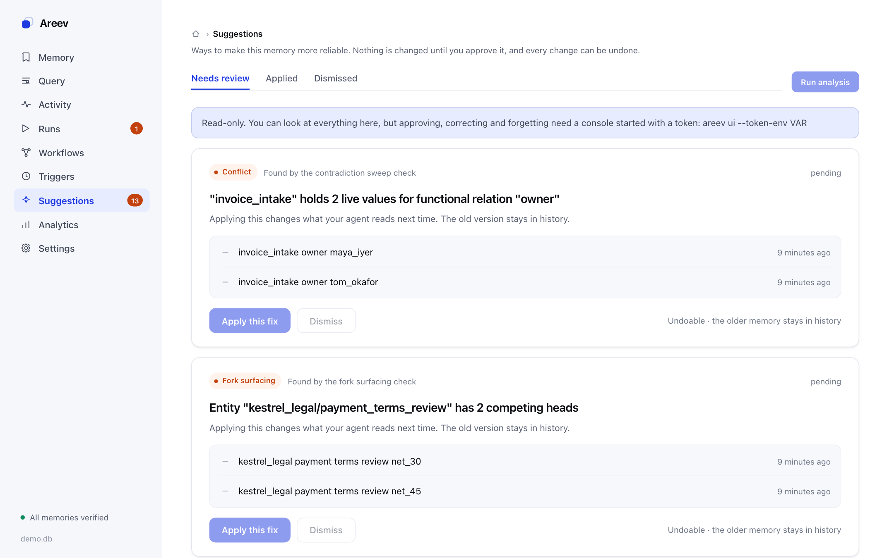
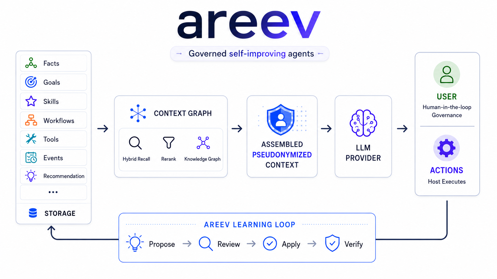
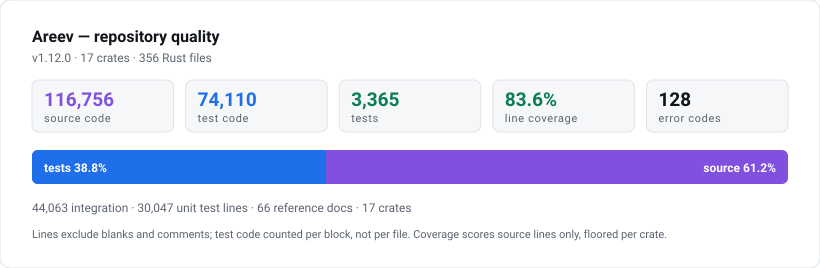
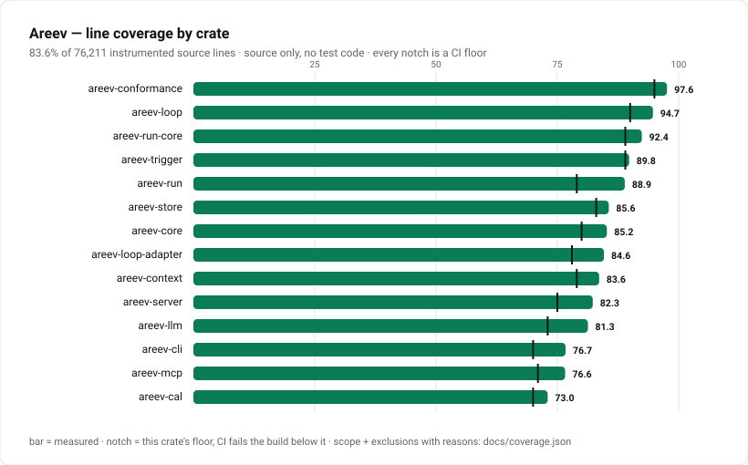

# Areev

**Build agents that improve from experience. Keep control of what changes.**

Areev is an open-source runtime for **governed, self-improving AI agents**.
Run workflows, assemble context with CAL, and turn execution history into
proposed improvements you can evaluate, approve, and reverse.

Persistent memory supplies the evidence. **Pseudonymization controls what
sensitive data reaches models.** Optional Jev decision models and integrations
with your model-training pipeline extend the same improvement lifecycle.

[](https://github.com/AreevAI/areev/actions/workflows/ci.yml)
[](#license)

[Quickstart](#try-it) · [Examples](#build-a-complete-agent) · [Documentation](#documentation) · [Benchmarks](crates/areev-bench/RESULTS.md) · [Discussions](https://github.com/AreevAI/areev/discussions)

```text
Run → Record experience → Propose a change → Evaluate → Approve → Apply
 ↑                                                                │
 └──────────── Measure the next runs; keep or roll back ────────────┘
```

## Try it

Install the CLI on macOS or Linux; no Rust toolchain required:

```bash
curl -fsSL https://raw.githubusercontent.com/AreevAI/areev/main/scripts/install.sh | sh
export PATH="$HOME/.local/bin:$PATH"
```

[Windows binaries](https://github.com/AreevAI/areev/releases) ·
[Build from source or use Docker](docs/quickstart.md#install).
Prebuilt Linux binaries require GLIBC 2.39+.

Seed a sample memory, generate improvement proposals, and open the review queue:

```bash
areev init --db areev-demo.db --template demo
areev loop run --db areev-demo.db
areev loop list --db areev-demo.db
areev ui --db areev-demo.db
```

Open [localhost:7437](http://127.0.0.1:7437) and select **Suggestions**.
Inspect each recommendation and its evidence. To approve and apply changes
from the console, [enable authenticated review](docs/loop.md#read-only-console-breaking-change).
This uses seeded data and deterministic analyzers: **no account, model key,
or external service needed**.

<picture>
  <source media="(prefers-color-scheme: dark)" srcset="demo/screens/suggestions-dark.png">
  
</picture>

*The screenshot shows the richer [committed demo memory](data/demo.db).
After cloning this repository, open it with
`areev ui --db data/demo.db --ns accounting`.*

## One improvement cycle, connected capabilities

| Capability | What you can do |
|---|---|
| **[Run agents](docs/run.md)** | Execute workflows with branches, retries, subgraphs, budgets, and human approval steps. Resume interrupted runs and verify their journals. [Triggers](docs/triggers.md) start workflows from schedules, events, or memory conditions. |
| **[Remember experience](docs/why-areev.md#1-the-record--and-the-turn)** | Keep facts, lessons, plans, and execution history in a content-addressed store. Trace changes, inspect past versions, and retrieve with structural, keyword, and vector search. |
| **[Engineer context with CAL](docs/cal-reference.md)** | Query memory and assemble model-ready context under a token budget, with priorities, summaries, and reusable queries. |
| **[Protect sensitive data](#pseudonymization-and-anonymization-controls)** | Apply namespace policies for pseudonymization, redaction, masking, and generalization before storage or on model-facing output. |
| **[Improve under governance](docs/loop.md)** | Detect patterns in history, propose changes with evidence, record review decisions, and measure outcomes after application. Roll back supported changes when they regress. |
| **[Add Jev decisions](#decision-models-including-jev)** | Use optional typed decision models for scoring, ranking, and supported workflow decisions, with deterministic fallbacks and authority enforced by code. |
| **[Govern model tuning](#from-experience-to-model-tuning)** | Export training corpora, connect your trainer, evaluate the resulting adapter, and govern its promotion and rollback. |

Use individual components with an existing agent, or use **Areev Run** for
execution. Embed through Python, TypeScript/Node, or Rust; connect agent hosts
through MCP. Local storage runs in-process in a Turso database file, with
PostgreSQL available for server deployments.

<details>
<summary>See how the components fit together</summary>



[Architecture](ARCHITECTURE.md) · [Why Areev](docs/why-areev.md)

</details>

## Pseudonymization and anonymization controls

Give models useful context while replacing detected sensitive values with
typed placeholders such as `[PERSON_1]` and `[EMAIL_1]`.

```bash
areev add --db private-demo.db --ns support \
  --subject caller:john --relation contact --object "j.doe@acme.io"

areev anonymize set --db private-demo.db --ns support \
  --policy '{"mode":"egress"}'

areev recall --db private-demo.db --ns support --subject caller:john
# Returned fields include subject: [PERSON_1], object: [EMAIL_1]
```

- **Egress policies** transform model-facing reads, including recall, CAL,
  and MCP. Configured runtime and decision-model calls also use pseudonymization.
- **Ingress policies** transform supported content before storage; **audit
  mode** measures detections without changing it.
- **Policy controls** include category rules, known identities, custom terms,
  contextual rules, and optional detector integrations.
- **Local rehydration** restores mapped values for applications and runtime
  tools. Mappings stay outside model payloads; a sealed vault supports
  reconstruction across processes.

Pseudonymization is reversible and does **not** by itself make data anonymous.
Coverage depends on the configured detectors and policy. Ingress and sealed
vaults require encrypted memory; runtime pseudonymization requires encrypted
memory with `scope: "memory"` for replay-stable tokens.

[Privacy recipes](docs/cookbook.md#16-pseudonymize-what-leaves-for-the-model-anonymization) ·
[Security boundaries](docs/security-model.md#what-reaches-a-model) ·
[Runnable clinical-referral example](examples/agents/clinical-referrals/)

## Does the improvement help?

In a synthetic support-desk benchmark, a fixed model performed 300 held-out
tasks across three independent task streams. Applying lessons derived from
its earlier failures improved task completion; removing those lessons removed
the gain, and restoring them brought it back:

| Memory state | Tasks passed |
|---|---:|
| Before lessons | 46.3% |
| Lessons applied | **68.7%** |
| Lessons rolled back | 47.0% |
| Lessons re-applied | **67.0%** |

The lessons in this run came from deterministic analysis with zero model
calls for lesson generation. These are results on a workload we designed,
not a guarantee for other agents. The model still makes calls to perform tasks.

[Results, controls, and caveats](crates/areev-bench/RESULTS.md#the-headline-run--2026-08-30-three-independent-task-streams) ·
[Reproduce the experiment](crates/areev-bench/SELFIMPROVE.md#reproduce)

The loop starts with deterministic analyzers. Optional LLM analysis adds
proposals grounded in recorded evidence and checked by an independent verifier.
Auto-apply is off unless explicitly granted by host policy; destructive and
LLM-originated changes cannot auto-apply. Evaluation gates constrain what can
be promoted. Hooks, cron, CI, or your host invoke the loop; Areev runs no daemon.

## Context engineering with CAL

**CAL is the Context Assembly Language.** Combine memories from multiple
sources, set priorities and budgets, and render the result for your model.
Context can degrade from full content to a summary or omission as the budget
fills. Saved queries and templates travel with the memory.

Try a budgeted query against the sample memory above:

```bash
areev cal --db areev-demo.db \
  'ASSEMBLE "deployment" FROM facts: (RECALL facts ABOUT "acme") BUDGET 800 tokens FORMAT sml'
```

This makes the agent's briefing inspectable and reusable across the CLI,
libraries, MCP, and console.
[CAL reference](docs/cal-reference.md) ·
[Saved queries and templates](docs/cookbook.md#15-ship-assembly-logic-in-the-file-saved-queries--templates)

## Decision models, including Jev

Attach **TypeSafe Jev** or a compatible decision backend to supply typed
scores, choices, and probabilities for supported judgments, including recall
reranking. Backends are optional and provider-configurable; code retains
control over permissions, approval, and application of changes.

In the recorded LoCoMo retrieval experiment, Jev reranking raised **hit@1
from 18.6% to 51.8%** over the same lexical-baseline candidate pool across
1,982 questions. This measures retrieval, not final-answer accuracy; hosted
decisions add latency and cost. Egress policies also cover decision requests.

[Configure decision backends](docs/cookbook.md#27-decision-backends-typed-calibrated-judgments) ·
[Measurements and costs](crates/areev-bench/RESULTS.md#9-decision-backend-reranking--locomo-retrieval-ab)

## From experience to model tuning

Use recorded agent trajectories to build a training corpus, hand it to your
trainer, and bring the resulting adapter back through evaluation and review:

```text
Execution history → Governed corpus → Your trainer → Candidate adapter
                                                    ↓
                                   Evaluate → Approve → Promote / Roll back
```

`areev corpus` exports trajectories with step-level weights and lineage.
`areev tune --cmd` connects an external trainer. Adapter promotion is checked
against a pinned evaluation set and recorded gating run. Areev supplies the
corpus and governance; training runs in your chosen training stack.

[Tuning walkthrough](docs/cookbook.md#then-tune-a-small-model-on-it-the-tuning-seam) ·
[Adapter governance](docs/loop.md#the-tuning-seam--adapter_revision)

## Build a complete agent

Start with the **invoice-to-accounting agent**: process invoices, route
approvals, accept corrections by email reply, and use recorded experience
in later runs. The same agent ships in Python, TypeScript, and Rust.

Run its Python example on macOS or Linux:

```bash
git clone https://github.com/AreevAI/areev.git
cd areev
python3 -m venv .venv
source .venv/bin/activate
python -m pip install areev

examples/agents/invoice-to-accounting/python/smoke.sh
examples/agents/invoice-to-accounting/python/improve.sh
```

The first script runs the desk through invoices, approvals, and corrections.
The second shows a correction helping the next invoice, analyzes run history,
and records a person's decision on a proposed fix. Both use synthetic fixtures
and mock integrations, with no model key or live mailbox required.

| Example | What to explore |
|---|---|
| [Invoice processing](examples/agents/invoice-to-accounting/) | Execution, approvals, corrections, and improvement from history |
| [Clinical referrals](examples/agents/clinical-referrals/) | Pseudonymized model requests and locally rehydrated results |
| [Incident response](examples/agents/incident-response/) | Prior incident knowledge informing the next response |
| [Revenue-cycle optimization](examples/agents/rcm-optimization/) | A proposed CAL query revision, human approval, and rollback |
| [Data-subject requests](examples/agents/data-subject-requests/) | Disclosure and erasure using the same identity selector |

[All agent examples](examples/agents/) ·
[How to build an Areev agent](examples/how-to-create-an-areev-agent.md)

## Use Areev in your stack

| Surface | Install |
|---|---|
| Python | `pip install areev` |
| TypeScript / Node | `npm install @areev/areev` |
| Rust libraries | `cargo add areev-store areev-core` |
| CLI, console, and MCP server | Prebuilt installer above, or `cargo install areev` |

The Python and Node packages embed the engine; install the CLI separately
for `areev ui` and the MCP server. With the CLI installed, connect Claude Code:

```bash
claude mcp add areev -- areev serve --mcp --db ~/.areev/code.db --ns claude-code
```

[Language quickstarts](docs/quickstart.md) · [MCP reference](docs/mcp-reference.md) ·
[Docker deployment](docs/docker.md) · [Migration](docs/migrate.md)

## Documentation

| Guide | Covers |
|---|---|
| [Quickstart](docs/quickstart.md) · [Cookbook](docs/cookbook.md) | Installation, bindings, and task recipes |
| [Run](docs/run.md) · [Triggers](docs/triggers.md) · [Packs](docs/pack.md) | Execution, scheduling, and shipping agents |
| [Loop](docs/loop.md) · [CAL](docs/cal-reference.md) | Improvement, evaluation, and context assembly |
| [Security model](docs/security-model.md) · [Erasure](docs/erasure.md) | Pseudonymization, encryption, authorization, and deletion |
| [GDPR map](docs/gdpr.md) · [EU AI Act map](docs/eu-ai-act.md) | Requirements mapped to capabilities and their limits |
| [Architecture](ARCHITECTURE.md) · [Grain types](docs/grains.md) | Storage, data types, and design decisions |
| [Benchmarks](crates/areev-bench/RESULTS.md) · [Quality](docs/quality.md) | Performance, experiments, and verification |
| [FAQ](FAQ.md) · [Changelog](CHANGELOG.md) | Common questions and releases |

Local recall runs in-process with no server in its path. Published benchmarks
cover desktop and Raspberry Pi hardware; hosted model and decision calls have
separate costs. Areev collects no telemetry. Optional encryption at rest,
retention policies, legal holds, and subject-level erasure support the data
lifecycle alongside pseudonymization.

<details>
<summary>Repository quality and coverage</summary>

<picture>
  <source media="(prefers-color-scheme: dark)" srcset="docs/assets/repo-stats-dark.svg">
  
</picture>

<picture>
  <source media="(prefers-color-scheme: dark)" srcset="docs/assets/coverage-dark.svg">
  
</picture>

CI checks metric drift, per-crate coverage floors, backend conformance, and
documented CAL examples. [How the numbers are produced](docs/quality.md).
The memory format and CAL conform to [OMS](https://github.com/openmemoryspec/oms).
Areev uses [Turso](https://github.com/tursodatabase/turso) for embedded storage;
see [third-party notices](THIRD-PARTY-NOTICES.md).

</details>

## Community and contributing

Share what you're building in [Discussions](https://github.com/AreevAI/areev/discussions)
or [r/Areev](https://www.reddit.com/r/Areev/). Contributions use the
[DCO](https://developercertificate.org/); start with [CONTRIBUTING.md](CONTRIBUTING.md)
and the [Code of Conduct](CODE_OF_CONDUCT.md). Report security issues through
[SECURITY.md](SECURITY.md).

**If governed self-improvement would help your agents, star Areev to help
other developers discover it.**

## License

Dual-licensed under [Apache-2.0](LICENSE-APACHE) or [MIT](LICENSE-MIT), at your
option. Contributions are dual-licensed under the same terms unless explicitly
stated otherwise. The OMS specification is CC0.

Built and backed by [MindGryd Software Private Limited](https://mindgryd.com).
