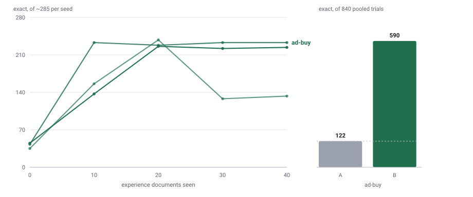

# Governed self-improvement on public ad-buy invoices

The second corpus. [`RECEIPTS.md`](RECEIPTS.md) measured the same claim on
ICDAR-SROIE retail receipts and found it twice over — a learner that made an
agent substantially better under human approval, and a gate that caught a
human-approved rule which had made it worse. One corpus is one corpus, so
this repeats the experiment somewhere deliberately unlike it.

## The corpus

**VRDU ad-buy forms**, the DeepForm collection (Wang, Zhu et al., *VRDU: A
Benchmark for Visually-rich Document Understanding*, KDD 2023,
[arXiv:2211.15421](https://arxiv.org/abs/2211.15421)): real political
advertising invoices filed with the US Federal Communications Commission,
each shipping the document's extracted text and human field annotations.
Fetched by `receipts/build_vrdu.py` from
[`google-research-datasets/vrdu`](https://github.com/google-research-datasets/vrdu)
as one gzipped JSONL, stdlib only and cached. Nothing from it is committed
here; only counts travel.

Of 641 records, **530 are kept** — 28 dropped for missing one of the three
always-required fields, 82 for a flight date the builder will not
disambiguate, 1 for an unparseable amount. Field coverage in what remains:
Gross Amount, Advertiser and Contract Number on all 530; Flight From on 437
and Flight To on 435.

## Why this corpus, specifically

It differs from SROIE on every axis that could otherwise confound a
replication:

| | receipts (SROIE) | ad-buy (VRDU) |
|---|---|---|
| document | Malaysian till receipt | US broadcast advertising contract |
| length | ~500 characters | **~5,200** median, 16,600 at p90 |
| day-one field | Invoice Date | **Gross Amount** |
| fields learned | vendor, amount, address | advertiser, contract number, two flight dates |
| date convention | `DD/MM/YYYY` | **`YYYY-MM-DD`** |
| amount convention | plain, two decimals | plain, two decimals, **no `$`, no separators** |

The date convention is the deliberate one. In run 1 of the receipts
experiment the loop authored *"convert extracted Invoice Date to ISO
8601"*, four gates passed it, and it took that agent from 30 correct to 0
because the receipts ledger wants day-first. **On this corpus that same rule
is correct.** So an agent that learns the convention from this business's
own corrections gets both right, and a model applying a general prior about
how dates should look gets exactly one right. That is a property no single
corpus can test.

## Pre-registered design (written before any paid run)

*Committed before a single paid invoice is read.*

**Scale.** Seeds 1, 2, 3. Per seed: 40 experience invoices with a learn pass
every 2 corrected invoices and a snapshot every 10, and 60 held out. Seeds
permute the corpus, so the three runs are three task sets.

**Legs, all pinned, temperature 0, request seed = the run seed** — the same
configuration receipts run 2 used, so a difference between the two results
is the corpus and not the setup:

| leg | model | pin |
|---|---|---|
| capture agent | `qwen/qwen3-30b-a3b-instruct-2507` | `coreweave/bf16` |
| learner (DISCOVER/VERIFY) | `qwen/qwen3-30b-a3b-instruct-2507` | `coreweave/bf16` |
| GROUND | `openai/gpt-4o-mini` | `openai` |
| rule reviewer | `openai/gpt-4o` | `openai` |

`discover_objective: learner`, `evidence_attribution: named`,
`outcome_evalset` naming the held-out set.

**Primary.** Exact match, paired over (invoice, field) by McNemar's exact
test, B against A, pooled and per seed, with the B-vs-B2 noise floor
reported beside it.

**Secondary**, pre-declared: the semantic metric; per-field coverage under
each arm; the learning curve at 0/10/20/30; the verify-then-revert leg; and
— specific to this corpus — **whether the loop authors an ISO date rule
here**, which is the same proposal that was wrong on receipts and is right
here.

**Stated in advance.** A null publishes as a null beside the receipts
result and would say the receipts finding does not generalise past one
corpus. A regression publishes with its per-rule verdicts and reverts, as
run 1's did. The reviewer is a model on the fixed rubric in
`receipts/accountant.py`, not a person, and its rejections are published
with their reasons.

## Result — three seeds

**It replicates, on documents ten times longer and a different filing
convention.** Evidence:
[`results/adbuy-vrdu-2026-09-04/`](results/adbuy-vrdu-2026-09-04/).

| seed | rules | A (rolled back) | B (applied) | B vs A | noise floor |
|---|:---:|:---:|:---:|:---:|:---:|
| 1 | 4 | 45/285 | **224/285** | 179 wins, 0 losses | 5 |
| 2 | 7 | 43/275 | **233/275** | 190 wins, 0 losses | 1 |
| 3 | 10 | 34/280 | **133/280** | 99 wins, 0 losses | 1 |
| **pooled** | | **122/840** | **590/840** | **468 wins, 0 losses** | 7 |

**Not one losing trial in 840.** Every transition is significant in every
seed, and the noise floors are 5, 1 and 1.

<picture>
  <source media="(prefers-color-scheme: dark)" srcset="../../docs/assets/adbuy-selfimprove-dark.svg">
  
</picture>

Regenerate it with `python3 scripts/receipts_chart.py --noun "ad-buy
invoices" docs/assets/adbuy-selfimprove "ad-buy=<results dir>"`.

### The two things receipts could not show

**The day-one field improved.** [`RECEIPTS.md`](RECEIPTS.md) records the
limitation plainly: all 286 of its wins fell on fields the baseline left
blank, and on Invoice Date — the field the agent already captured on every
receipt — the rules won *nothing*. The claim it supported was narrow.

Here Gross Amount, which both arms fill on every invoice, goes:

| seed | A | B |
|---|:---:|:---:|
| 1 | 45/60 | 57/60 |
| 2 | 43/60 | **60/60** |
| 3 | 35/60 | 59/60 |

The loop learned the amount convention — *"a plain number with two
decimals, no dollar sign and no thousands separator"* — and applied it to a
field the agent had never failed for want of trying. Seed 2 reaches every
invoice. That is the claim the receipts corpus could not support.

**The same date rule, right this time.** Receipts run 1's loop authored
*"Convert extracted Invoice Date to ISO 8601 (YYYY-MM-DD)"*, four gates
passed it, and it took that agent from 30 correct to 0 because that ledger
files day-first. **All three seeds here independently authored the ISO
rule**, and here it is correct — 43/53, 40/48 and 33/50 exact on flight
dates against zero in every arm A. Same rule, opposite corpora, right both
times, because it came from each business's own corrections rather than
from a prior about how dates should look.

### The learning curve, and what seed 3 did to itself

Held-out exact match scored at 0, 10, 20, 30 and 40 experience invoices —
the same 60 documents every time — with the number of approved rules in
memory at each point:

| experience invoices | seed 1 | seed 2 | seed 3 |
|---|:---:|:---:|:---:|
| 0 (no rules) | 45 | 43 | 35 |
| 10 | 137 *(2 rules)* | 233 *(4)* | 156 *(5)* |
| 20 | 226 *(3)* | 228 *(6)* | **238** *(8)* |
| 30 | 222 *(4)* | 233 *(7)* | **128** *(10)* |
| 40 | 224 *(4)* | 233 *(7)* | 133 *(10)* |

Seeds 1 and 2 climb and hold. **Seed 3 climbs higher than either — 238 of
280, more than seed 1 ever reaches — and then its own next two rules take it
to 128.** That is the finding. The regression is not against another seed;
it is against itself, twenty invoices earlier, and it costs 110 trials.

The last ten invoices taught it nothing at all: the rule set is the same ten
at 30 and at 40, and the two measurements of it land 5 apart, which is the
scale of this seed's noise floor.

### The mechanism: ten rules, four facts

The two rules approved in the window where the score fell are both
**restatements of rules already in memory**:

> Extract and record Flight From, Flight To, Gross Amount, advertiser, and
> contract number from every receipt using the exact values and format as
> printed, without exceptions.

> Extract and record the contract number from every receipt, using the exact
> value as printed, such as 2381227, **without substituting or omitting it**.

The first restates the whole rule set as one sentence. The second restates
the contract-number half of a rule approved twenty invoices earlier, and
carries a literal value — `2381227` — memorised from one invoice into a rule
meant to be general.

Read one at a time, each is true, well-formed and about this business. That
is why the reviewer approved them. Read together they are four distinct
facts stated ten ways, and the effect on the agent is visible in coverage
rather than in formatting:

| seed 3, arm B | coverage | exact |
|---|:---:|:---:|
| Gross Amount | 60/60 | 59/60 |
| Flight From / To | 40/50, 40/50 | 33, 35 |
| **Advertiser** | **4/60** | 4/60 |
| **Contract Number** | **3/60** | 2/60 |

The agent **stopped producing** the two fields its rules most insistently
demand. This is receipts run 1's failure
([rule accumulation suppressing capture](RECEIPTS.md#the-gain-that-did-not-survive-and-why-it-is-reported))
reproduced on a second corpus, on a different document type, at ten rules
instead of three.

**The engine has a dedup key and it did not fire.** `authored_dedup_key`
fingerprints a proposal's content, so it catches a rule proposed twice
verbatim. It cannot catch the same instruction rephrased, which is exactly
what an LLM proposer emits. Semantic near-duplicate suppression is not in
the engine, and this run is the argument for it.

### The gate said `held`, and the gate was right

Baseline 35, current 133: seed 3 ends four times better than the agent it
started as. **Verify** measures harm against the deployed baseline, and by
that measure nothing went wrong. It never sees that the same agent, on the
same documents, stood at 238 two rules ago.

That is a real limitation and it is not a bug: **outcome measurement catches
damage, not lost opportunity.** Catching this needs a signal the engine does
not have — a per-rule marginal measurement, or a high-water mark carried
forward as the comparison point instead of the baseline. The second is
cheap, and this run is the case for building it.

### The planted-regression leg on this corpus

Seeds 1 and 2 passed every check: rules `held` at 45→224 and 43→233, the
planted rule dropped them to 209 and 227, both measured `regressed` and
reverted back to 224 and 233 exactly. Seed 3's failed, and the harness says
so rather than claiming a pass: the planted rule *raised* its score
(133→144), so there was nothing to catch.

One bookkeeping consequence, stated because anyone re-reading these files
will hit it: because seed 3's revert never fired, its `ledger.db` ends with
**eleven** rules — the ten it learned plus the planted one still applied.
Arm B was measured before that leg ran, so every published seed 3 number is
the ten-rule agent. The eleventh rule is the fixture, not a lesson.

The reason it did not bite is worth stating — the planted fixture is
SROIE-shaped, naming an "Invoice Date" this corpus does not have. It bites here only obliquely,
through flight dates, and on a weaker run that bite is inside the noise. A
profile-specific harmful rule would be the better test and is not written.
Reported because a sub-test that cannot mean anything must say so.

### Cost

Measured as the account-level delta: **≈$0.90** for all three seeds, on
documents whose median length is ten times the receipts corpus. The whole
programme across both corpora, every ablation cell and both τ² probes comes
to **$2.41**.
