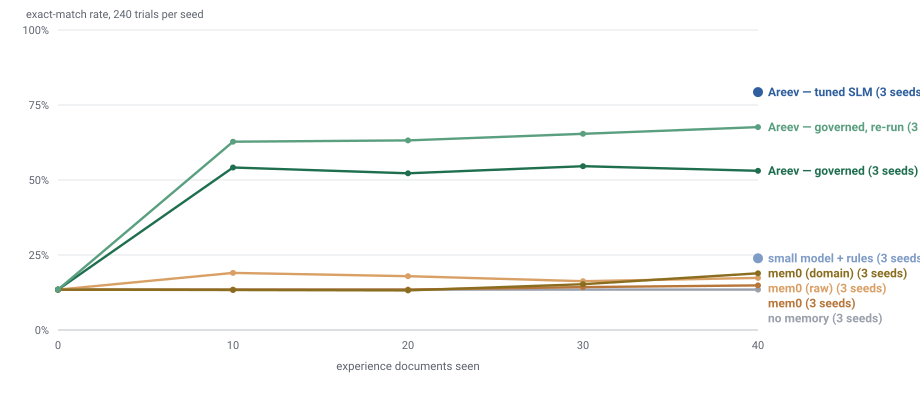
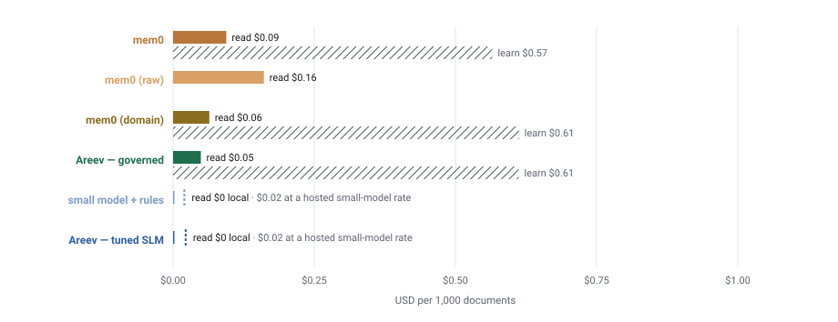

# Four ways to carry something forward

The question this answers, in the form it was asked: *does an agent whose
memory is governed — where new rules are derived from the pattern of its own
past runs, proposed, reviewed and measured — do better than an agent with a
plain memory it has to be told what to store in, and than one with no memory
at all? And what does each cost?*

Four arms, one task, one axis of difference:

| arm | what carries forward between documents | who decides what is remembered |
|---|---|---|
| **no memory** | nothing | — |
| **mem0** | facts mem0 extracts from each exchange and retrieves by similarity before the next | the caller's `add()` and mem0's extractor |
| **Areev — governed** | rules the loop proposed from the run's own history, a reviewer approved, and the outcome gate measured | the loop, then a reviewer |
| **Areev — tuned SLM** | a 1.5B model trained once on the governed memory, replacing the LLM agent | the loop, then `areev tune` |

Evidence: [`results/fourway-2026-09-05/`](results/fourway-2026-09-05/).
Every number below is recomputed from raw trials by `receipts/fourway.py`,
and every dollar from the usage ledger every model call writes to.

## The setup, held constant

The receipts protocol [`RECEIPTS.md`](RECEIPTS.md) pre-registered: real
ICDAR-SROIE receipts, 40 experience documents and 60 held out per seed,
three seeds, the same splits, the same capture agent
(`qwen3-30b-a3b-instruct-2507`, pinned, temperature 0, seeded), the same
accountant with the same fixed rubric. The governed arm **is** run 2 of
that document, unchanged. The others were added beside it on the same
seeds, so every trial in every arm pairs with every other per (document,
field), and the comparisons are McNemar's exact test.

That the setup really is constant across harnesses was checked rather than
assumed: mem0's own no-memory arm and the governed run's rolled-back arm
agree **trial-for-trial, 240 of 240** on seed 1, and the governed arm's
independent re-run reproduced its rolled-back arm exactly on all three seeds
— two of them on a different provider.

### mem0, three ways

mem0 is not one thing, so it is run as three:

- **as installed** — `mem0ai` 2.0.20 with its default extractor, a *"Personal
  Information Organizer"* tuned for preferences, names and plans;
- **domain hint** — the same with `custom_instructions`, mem0's supported
  hook, telling the extractor these are operational corrections to a capture
  agent;
- **raw** — `infer=False`: every message stored verbatim. The literal
  *store and retrieve*.

In every mode it is used exactly as its README says to: `add()` the exchange
after each document, `search()` the receipt before the next, put what comes
back in the prompt. Its language model is the same model Areev's learner
uses, at the same provider, so the comparison is architecture against
architecture, not two budgets. Embeddings run locally (`mxbai-embed-large`
under Ollama) and cost nothing.

### The small model

`slm_corpus.py` turns the governed memory into a training corpus: for each
experience document, the receipt the agent saw and the **row the accountant
filed**, under the day-one instruction plus the approved rules as they stood
at the end. `mlx_lm` trains a LoRA on `Qwen2.5-1.5B-Instruct` (4-bit) from
it — 34, 30 and 35 rows; 200 steps; eight to twelve minutes on a laptop — and
`slm_serve.py` drops the result into the harness as the agent, under arm
B's exact prompt. The **untuned** base is evaluated under the same prompt as
the control that separates *a small model with rules* from *a small model
tuned on the governed corpus*. Held-out documents never enter the corpus.

## Accuracy

Exact matches of 720 held-out trials (60 receipts × 4 fields × 3 seeds),
the same receipts re-read as the deployment proceeds:

| arm | 0 | 10 | 20 | 30 | 40 docs | vs governed, paired |
|---|:---:|:---:|:---:|:---:|:---:|---|
| no memory | 97 | | | | **97** | 286 wins, 1 loss |
| mem0, as installed | 97 | 97 | 97 | 103 | **107** | 288 wins, 13 losses |
| mem0, raw store | 97 | 137 | 129 | 117 | **125** | 286 wins, 29 losses |
| mem0, domain hint | 97 | 96 | 95 | 110 | **136** | 286 wins, 40 losses |
| **Areev — governed** (run 2) | 97 | 390 | 376 | 393 | **382** | — |
| Areev — governed, independent re-run | 97 | 452 | 455 | 471 | **487** | 111 wins, 6 losses *(re-run over run 2)* |
| untuned 1.5B + the same rules | | | | | **172** | 226 wins, 16 losses |
| **Areev — tuned 1.5B** | | | | | **571** | **234 wins, 45 losses** *(SLM over governed)* |

Every comparison is p < 0.0001. Per seed:

| seed | none | mem0 | mem0 raw | mem0 domain | governed | re-run | 1.5B untuned | **1.5B tuned** |
|---|:---:|:---:|:---:|:---:|:---:|:---:|:---:|:---:|
| 1 | 31 | 31 | 41 | 57 | 123 | 150 | 76 | **197** |
| 2 | 36 | 47 | 44 | 49 | 141 | 167 | 71 | **185** |
| 3 | 30 | 29 | 40 | 30 | 118 | 170 | 25 | **189** |

Every arm's repeat run agreed with its first to within two trials, and most
to zero.

### Plain memory buys a little, and all of it on one field

Across three modes and three seeds, mem0 gains between +10 and +39 over no
memory. Every one of those trials is on Invoice Date — the field the day-one
agent already produces. **In no mode, on no seed, did the agent with mem0 ever
attempt vendor, amount or address.** Coverage stayed at 60 of 240 for the
entire deployment, exactly where it started.

What it stored explains why. Given the accountant's *"Thanks — I also need the
vendor and the amount on every one of these, otherwise I can't file it"*, the
default extractor remembered:

> User was recommended to include the vendor name 'B & BEST RESTAURANT' and
> the total amount 'RM7.40' for proper filing…

> User made a purchase at B & BEST RESTAURANT located at No.12, Jalan SS4C/5…

A fact about one receipt, addressed to a shopper. The next receipt is a
different vendor, so the memory is inert. The domain hint changed the wording
and not the shape — the persona is appended to, not replaced. And **raw mode
stored the accountant's sentence verbatim** and retrieved it into the prompt
382 times over one seed, under a heading that said *relevant memories*, and
the agent kept filing one field. A memory of someone once saying a thing is
not an instruction.

### Governing changes what the agent does

The governed arm's first checkpoint is 390 — four times the floor after ten
documents — and it holds. The same sentence mem0 stored, rewritten by the
loop as *"Extract and record the vendor name and amount on every receipt, not
just the date"* and placed under *instructions from the accountant*, took
coverage to 240 of 240. The difference between the two curves is not how well
the agent formats what it attempts; it is what it attempts at all.

The independent re-run — same seeds, same configuration, a day later —
learned different rules and scored 487. That is the learner's run-to-run
spread, 111 wins to 6 over its own first run, and it is drawn as its own line
rather than averaged away: the agent leg is bit-reproducible; the DISCOVER
leg is not, even pinned and seeded.

### The tuned small model beats the model it was distilled from

Under the same prompt on the same receipts:

| | seed 1 | seed 2 | seed 3 |
|---|:---:|:---:|:---:|
| untuned 1.5B + rules | 76 | 71 | 25 |
| 30B LLM + rules | 123 | 141 | 118 |
| **tuned 1.5B** | **197** | **185** | **189** |

The untuned small model sits well *below* the LLM — so this is not "small
models happen to suit this format". (Whether it is instead "the model
memorised the shops" is the next section's question; the short answer is
partly, and the win survives on shops it never saw.) Ten minutes of training
on the rows the loop produced took it from 76 to 197 on seed 1, with zero noise on repeat, and
past the LLM on every seed. Where the gain landed says why: on seed 1,
**Vendor Address went 0 → 42 of 60**. That is the field that needs
punctuation and spacing copied verbatim, which a prose rule describes badly —
the 30B LLM, carrying *"copy the address exactly as printed"*, managed **0 of
60** on that seed — and a filed example teaches directly. The date field moved
too, 31 → 56, on a format the LLM had been told in words.

### Did the tune overfit? Partly — and the split is clean

**The question.** The held-out receipts are disjoint from the training
corpus by construction. But SROIE is 612 receipts from **225 shops**, so
roughly half of any held-out set comes from a *vendor* whose other receipts
were in the corpus — 32, 28 and 30 of 60 on the three seeds. A model that
had memorised *"B & BEST RESTAURANT, No.12 Jalan SS4C/5"* would ace that
shop's next receipt without having learned anything about how this business
files. Is the 234–45 win over the LLM that, or the conventions?

**Same dataset, same pipeline, one more cut.** Nothing was re-run.
`slm_overfit.py` takes the trials already published, marks each held-out
receipt by whether its vendor appears in that seed's `train.jsonl`, and
pairs the tuned model against the LLM on each half separately. Validation
loss is reported alongside: it fell monotonically on every seed (0.63 → 0.16,
0.54 → 0.03, 0.62 → 0.07) and never turned upward, so this is not overfitting
in the loss sense — that check is necessary and, with four validation rows,
nowhere near sufficient.

| exact-match rate, three seeds | seen vendor (360) | **unseen vendor** (360) |
|---|:---:|:---:|
| no memory | 13% | 14% |
| untuned 1.5B + rules | 23% | 25% |
| 30B LLM + rules | 51% | 55% |
| **tuned 1.5B** | **88%** | **71%** |
| tuned over LLM, paired | 144 wins, 12 losses | **90 wins, 33 losses** |

**On vendors it has never seen, the tuned model still beats the 30B LLM —
71% to 55%, 90 wins to 33, p < 0.0001.** The edge shrinks from 37 points to
16, so about half of the headline gap was vendor familiarity; the other half
is general. Per field on the unseen half says exactly what it learned:

| unseen vendors only | tuned | LLM | untuned |
|---|:---:|:---:|:---:|
| Invoice Date | **78**/90 | 48/90 | 39/90 |
| Vendor Address | **42**/90 | 8/90 | 1/90 |
| Amount | 79/90 | 78/90 | 15/90 |
| Vendor Name | 56/90 | **64**/90 | 35/90 |

It learned the **date convention** (78 against 48 on shops it never saw) and
it learned to **transcribe an address verbatim** (42 against 8 — a skill,
not a lookup, since these addresses were not in its corpus). Amount is a
tie. And on **Vendor Name it is worse than the LLM on unseen shops**, 56
against 64, having been 83 on seen ones: the names it memorised. That is
the overfit, located to one field, and it is the field a filed-row corpus
would be expected to teach as identity rather than as method.

**Verdict.** The tune generalises the business's conventions and memorises
its vendors. The publishable claim is the unseen-vendor one — a 1.5B model
tuned on the governed corpus beats the 30B model it was distilled from on
receipts from shops it has never seen, 71% to 55% — and the seen-vendor
number is reported as what it is: a deployment's real advantage on repeat
customers, and not evidence of learning. The corpus is 34 rows; a
vendor-held-out split at corpus-building time, or five seeds, would tighten
the general half. Evidence: `OVERFIT.json`, recomputed by
`receipts/slm_overfit.py` from the published trials.

## Cost

From journaled tokens, three seeds, priced at OpenRouter's list on the day.
Two numbers, because they answer different questions:

| arm | **read** — $ per 1,000 documents the agent reads | **learn** — $ per 1,000 documents the memory learns from |
|---|:---:|:---:|
| no memory | 0.05 | — |
| mem0, as installed | 0.09 | 0.57 |
| mem0, raw store | 0.16 | 0.00 |
| mem0, domain hint | 0.06 | 0.61 |
| **Areev — governed** | 0.05 | **0.61** |
| Areev — tuned 1.5B | **0 local**, 0.02 at a hosted small-model rate | one-time training |

**Governance costs the same as extraction.** The loop spent $0.0735 to learn
from 120 documents — DISCOVER and VERIFY on the learner, GROUND on
`gpt-4o-mini`, and 33 reviewer calls to `gpt-4o` — against mem0's $0.0678 for
its extract-and-update calls over the same documents. Same price to remember;
ten times the return. And 56% of the loop's spend is the reviewer alone,
which is the obvious place to try a cheaper model next.

**Plain memory makes reading dearer.** Retrieved memories pad every prompt:
raw mode's reads cost three times the governed arm's, for 125 against 382.

**The tuned model is the cheap one twice over.** It reads a receipt for 628
prompt and 98 completion tokens on a laptop at zero marginal cost — two
hundredths of a cent at a hosted small-model rate, 40% of the LLM's — and it
needs no rules in flight, no reviewer, no loop calls. Its cost is ten minutes
of training, once, from a corpus the governed loop had already produced.

<picture>
  <source media="(prefers-color-scheme: dark)" srcset="../../docs/assets/fourway-accuracy-dark.svg">
  
</picture>

<picture>
  <source media="(prefers-color-scheme: dark)" srcset="../../docs/assets/fourway-cost-dark.svg">
  
</picture>

## Prompt structure: where the rules go, and how they are written

One fixed rule set — the memory each governed run left — read against
the same held-out receipts under every combination of **where** the rules go
and **how** they are written. Nothing is learned here; this is the
measurement the loop would need before it could *propose* a template rewrite,
which is where Areev lets learning reach the prompt's structure and not only
its content.

Three positions: after the day-one instruction in the system prompt (the
published arm B), before it, and at the head of the user turn ahead of the
receipt. Five renderings of identical rule text under an identical header:
markdown (arm B's section byte-for-byte), JSON, XML, a CSV-like table
(`toon`), and CAL's own decorated grain render, which prefixes each rule with
its subject and relation and suffixes confidence and date. Exact of 720,
three seeds, (wins/losses) against the published cell:

| rules placed… | markdown | json | xml | toon | CAL's decorated render |
|---|:---:|:---:|:---:|:---:|:---:|
| after the instruction, in system | **367** | 379 (16/4) | 363 (7/11) | 366 (6/7) | 378 (15/4) |
| before the instruction, in system | 76 (3/294) | 77 (6/296) | 120 (7/254) | 111 (9/265) | 73 (4/298) |
| at the head of the user turn | 366 (6/7) | 368 (7/6) | 362 (10/15) | 368 (9/8) | 376 (18/9) |

**Format does not matter.** Where the rules come after the instruction, every
container lands within a few discordant trials of every other. JSON and CAL's
decorated render edge markdown by about a dozen trials (16/4 and 15/4, p ≈
0.01–0.02) — real, and small. XML, the table and the user turn are
indistinguishable from the baseline.

**Position matters enormously.** The same text placed *before* the day-one
instruction loses between 254 and 298 of 720 trials and lands near the
no-memory floor, in every format. The instruction that follows it simply
wins. Structured containers fail somewhat less at the top — XML 120, the
table 111 — as if a block that looks like data resists being overridden by
the prose after it better than a bulleted list does, but none of them
survive it.

For the loop this is direct. A `DEFINE TEMPLATE` proposal that moves where or
how rules render is not cosmetic; it can be worth the whole difference
between a rule set that works and one that is ignored, and the outcome gate
should measure it exactly as it measures a rule.

*The baseline cell replicates the published arm.* Seeds: 123 (published 123), 147 (published 141), 97 (published 118), on a different
provider from the original for two of the three. *A first run of this grid
is not published:* it rendered every format through CAL's decorated form and
had lost the header clause telling the agent to put required fields in its
JSON, and under those two changes together a seven-rule memory scored 35
where its published prompt scored 141. Whichever half did the damage, the
grid above removes both and measures the decoration on its own.

## What is reported and not claimed

**One corpus, one task family.** Three seeds of structured field extraction
on receipts. The second corpus ([`ADBUY.md`](ADBUY.md)) replicated the
governed result; the mem0 and SLM arms have not yet been run on it.

**A stationary ledger.** Every arm here learned a business that held still.
[`DRIFT.md`](DRIFT.md) shows the governed loop does not yet retract a rule
the business has replaced, and the tuned model has no mechanism to track a
change at all. Both are the follow-on.

**mem0 was not tuned by us.** Its extraction persona cannot be replaced
through its configuration, only appended to; a "best-case mem0" would mean
rewriting its extractor, at which point it is no longer mem0. The three modes
bracket what its supported surface can do, and all three are published.

**The governed arm ran twice, and the runs differ.** Run 2 (382) is the
pre-registered, published result and anchors every paired test here; the
re-run (487) was made to meter cost and is drawn beside it. Both stand.

**Provider events.** The pinned endpoint every arm ran on was de-listed by
OpenRouter partway through the metered re-run; its seeds 2 and 3 ran on a
replacement at the same list price, recorded in their configs, and their
rolled-back arms matched the originals trial-for-trial regardless. Seed 1 of
that re-run took nine failed calls during the outage — two in its baseline
pass and seven in its curve legs, none in its final evaluation, which is
clean. mem0 domain seed 3 took four in its final evaluation's control arms
(none in its memory arm). Every other published arm took none.

**Cost is list price.** The tuned model's hosted-rate shadow is a stand-in
labelled as one; its real marginal cost here was electricity.

## Reproduce

```bash
cd crates/areev-bench/receipts
export OPENROUTER_API_KEY=…                       # ollama with mxbai-embed-large for mem0's embeddings
for S in 1 2 3; do SEED=$S sh curve.sh runs/areev 40 60 10; done              # the governed arm, metered
for M in default raw domain; do for S in 1 2 3; do
  SEED=$S sh mem0.sh runs/mem0/$M/seed$S --mode $M --snapshot-every 10; done; done
for S in 1 2 3; do
  python3 slm_corpus.py --learned-db runs/areev/seed$S/ledger.db --dataset data/sroie.jsonl --seed $S --out runs/slm/seed$S/corpus
  sh slm_train.sh runs/slm/seed$S/corpus runs/slm/seed$S/adapter 200
  SEED=$S sh slm_eval.sh runs/areev/seed$S/ledger.db runs/slm/seed$S/eval-tuned lora runs/slm/seed$S/adapter
  SEED=$S sh slm_eval.sh runs/areev/seed$S/ledger.db runs/slm/seed$S/eval-base  base none
done
python3 fourway.py --areev runs/areev --areev-cost runs/areev --mem0 runs/mem0 --slm runs/slm --out charts/fourway --json FOURWAY.json
```
