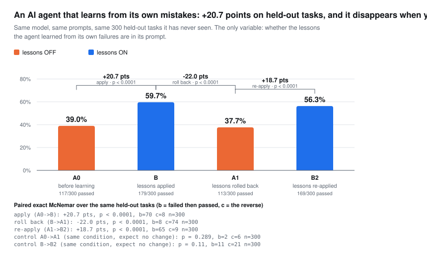

# areev-bench — adoption benchmark results (first pass)

*Run: 2026-07-06 · Apple M4 Max, macOS 26.5 (laptop — commodity-CI rerun
pending, same caveat as the earlier m0 substrate spike) · all harnesses in this crate,
`--release`, workspace LTO profile · dataset everywhere: 10k facts / 800
subjects (the `bench.rs` shape), identical query workloads per surface via
seeded xorshift.*

Four benchmarks (per the design doc): frame chart, trust suite, **honesty metrics**
(§3), and the **LoCoMo self-run** (§4) — retrieval hit-rate plus LLM-judged
end-to-end answer accuracy (bring-your-own reader/judge).

## 1. Frame chart — "recall inside an audio frame"

`cargo run --release -p areev-bench --bin frame_chart`
(needs `cargo build --release -p areev` first for the MCP leg)

One retrieval op — up to 16 most-recent facts about a caller — measured over
every surface a voice developer could actually deploy. Nothing simulated:
the HTTP and MCP legs drive the real `UiServer` and the real `areev serve
--mcp` binary over real sockets/pipes.

| surface | p50 µs | p95 µs | p99 µs | p99 as % of one 50ms frame |
|---|---|---|---|---|
| A in-process `recall` (voice hot path) | 33.1 | 46.6 | 60.2 | 0.12% |
| B localhost HTTP `/api/cal` (sidecar) | 158.1 | 216.3 | 263.5 | 0.53% |
| C MCP stdio `areev_recall` (agent host) | 128.6 | 181.5 | 205.0 | 0.41% |
| — network memory service (reference) | — | — | — | Zep's own enterprise headline: "retrieval under 200 ms" = **400%** of one frame (vendor-stated, not measured here) |

Readings: (a) every Areev surface fits inside 0.6% of a frame; the
category's stated floor is 4 frames. (b) Even *our own* localhost sidecar
costs ~5x the in-process path — transport, not storage, is the latency
budget, which is the whole architectural argument. (c) MCP stdio at ~129µs
p50 is the Claude Code / agent-host number.

### 1b. Binding-level latency — what a real-time turn actually pays

*Run: 2026-08-19 · Apple M4 Max · `@areev/areev` release addon, driven from
Node 22 · 2,200 grains (2,000 Events across 50 sessions + 200 Facts) · 300
iterations after 30 warmup · statements pre-warmed with `calPrepare`.*

§1 measures the Rust store. A real-time voice or chat turn does not call the
Rust store — it calls a **binding**, with a statement **string**, and pays
lexing, parsing and planning unless something reuses the plan. These rows
close that gap: same process, same machine, measured from JavaScript.

| statement (from Node) | backend | p50 ms | p95 ms | p99 ms |
|---|---|---|---|---|
| `RECALL events RECENT 20` | embedded (Turso file) | 0.17 | 0.48 | 0.86 |
| `ASSEMBLE` (3 sources, BUDGET 900, FORMAT markdown) | embedded (Turso file) | 0.20 | 0.65 | 0.93 |
| `thread_tail` 20 events | embedded (Turso file) | 0.08 | 0.28 | 0.58 |
| `RECALL events RECENT 20` | Postgres 16, loopback Docker | 1.06 | 1.82 | 3.39 |
| `ASSEMBLE` (3 sources, BUDGET 900, FORMAT markdown) | Postgres 16, loopback Docker | 4.29 | 13.72 | 32.55 |
| `thread_tail` 20 events | Postgres 16, loopback Docker | 1.68 | 3.35 | 6.36 |

**Can the Postgres backend meet a ~100 ms real-time memory budget?**
On loopback, comfortably — the worst row here is a 32.6 ms p99 for a
three-source assembly, a third of the budget. Off loopback it depends on one
number: **round trips × added RTT**. A three-source `ASSEMBLE` is tens of
statements (see the round-trip table in
[`docs/postgres-backend-proposal.md`](../../docs/postgres-backend-proposal.md)),
so a same-region managed Postgres at ~1 ms RTT adds tens of milliseconds and
the budget gets tight at p99; a cross-region hop does not fit at all.

*Not measured here:* managed Cloud SQL. These are loopback-Docker figures on
one machine and are labelled as such — extrapolate with the round-trip count,
do not quote them as managed-database numbers.

The embedded rows are the ones to design a voice turn around: `thread_tail` at
0.08 ms p50 is the read every conversational turn makes, and it is
**index-backed** (`idx_thread(ns, session, seq)`) rather than a namespace scan
filtered afterwards.

## 2. Trust suite — durability + integrity artifacts

`cargo run --release -p areev-bench --bin trust_suite` (exit 0 = all pass;
CI-gate shaped)

| artifact | result |
|---|---|
| T1 kill −9 mid-write → reopen | **PASS** — 4,858 grains survived a SIGKILL during continuous writes; `integrity=ok`, 0 hash mismatches, 0 undecodable |
| T2 tamper detection | **PASS** — attacker with file access flips 1 byte in 1 of 100 stored blobs (verified persisted via independent connection); `verify` content-address recheck reports exactly 1 mismatch |
| T3 deletion-remnant scan | **evidence, both ways** (below) |
| T4 point-in-time restore | **PASS** — 5,000-op bundle (0.7 MB); full restore 2.9s (~1,750 ops/s, integrity ok); restore-until-HLC applied exactly 2,501 ops |

### T3, the honest-erasure evidence

The same adversarial byte-scan (find a deleted secret in the raw files) run
against both engines:

- **SQLite, upstream defaults** (`secure_delete=OFF`): secret **still present**
  in the main db file after a WHERE-scoped `DELETE`. Gone only after a manual
  `wal_checkpoint(TRUNCATE); VACUUM;` — operations no application runs on a
  schedule. (Note: Apple's *system* sqlite3 ships `secure_delete=2`/FAST, which
  does scrub — that is an Apple patch, not stock SQLite behavior; the bench
  measures both.)
- **Areev `forget`**: recall returns nothing, the op-log records the
  tombstone — but secret bytes **still present** in the WAL at file level.
  `forget` is an auditable index-level removal, not byte erasure, exactly as
  designed.

Conclusion the suite exists to keep precise: logical deletion is not byte
erasure in *any* SQLite-lineage engine. The only honest erasure is per-file
crypto-erasure (key destruction) — now wired in the store
(`Areev::open_encrypted` / `open_with_passphrase`, AES-256-GCM + Argon2id)
and proven by `areev-store/tests/encryption_tests.rs`: reopen without the
key (or with the wrong key) is denied, and a plaintext-marker scan of the db
and WAL bytes finds no leak. The `.blobs` CAS sidecar remains plaintext
(loud open warning) — see `docs/security-model.md`.

## 3. Honesty metrics — the numbers incumbents won't publish

`cargo run --release -p areev-bench --bin honesty_metrics` (exit 0 = all gates hold)

Four structural properties, measured deterministically — no LLM, no network,
no competitor hosting, so anyone can reproduce them and nobody can fudge them.
Contrast column cites primary GitHub issues by number.

| metric | measured | the failure it answers |
|---|---|---|
| **M1 idempotency** | 808 byte-identical writes → **1 grain** (807 rejected on content address) | mem0 #4573: a hallucinated "User prefers Vim" stored **808×** (97.8% of a 10k store was junk) |
| **M2 staleness-rate** | 20 supersessions → recall surfaces **1** current value (0 stale), **21-deep** history retained; the same as naive appends → recall surfaces **all 21** | mem0 #5330 (stale co-ranks), #4536 (update deletes both → empty memory) |
| **M3 write-cost** | **136µs/write** amortized (7,343/s); single-add p50 **117µs** / p99 5.2ms — **0 LLM calls, 0 tokens, $0** | mem0: 2 LLM calls/write, ~$0.30–0.80 per 100-turn chat (openwalrus), 20s add (#2813) |
| **M4 provenance** | **100%** of 504 grains carry an op-log record (op + HLC + content address); derived facts trace to their source Observation; supersession lineage reconstructs | mem0 #4573: developers hand-build a `memory_sources` table to see why a memory surfaced |

Scope, kept honest:
- M1 is EXACT-duplicate collapse (identical content incl. `created_at`) — the
  property that makes bundle import / op-log replay / retried sync idempotent.
  It is NOT a paraphrase deduper; near-duplicate phrasings need a write-time
  novelty gate (roadmap).
- M2's clean recall depends on using `supersede` (the intended update path); a
  blind re-`add` of a new value co-ranks like an append-only store. The point
  is that Areev *has* the primitive and it costs an index-layer flip, not two
  LLM calls — the update model mem0 lacks.

## 4. Accuracy — LoCoMo self-run

`cargo run --release -p areev-bench --bin accuracy -- <locomo10.json> [conv_limit]`
(dataset: snap-research/locomo `data/locomo10.json`)

The Areev half of the LR-1 accuracy story. Every conversation turn is ingested
as an Event; each question asks `recall_hybrid` for the top-k turns and we check
whether a gold-evidence turn (LoCoMo `evidence` dia_ids) is in the set. Full
LoCoMo: **10 conversations, 5,882 turns, 1,982 answerable QAs.**

The embedder is pluggable (`EmbedBackend`), so we report both the no-API floor
and a real semantic model. hit@k = at least one gold-evidence turn (LoCoMo
`evidence` dia_ids) in the top-k.

| embedder | hit@1 | hit@10 | hit@20 | MRR@10 |
|---|---|---|---|---|
| **OpenAI text-embedding-3-small (512-d)** | **33.1%** | **74.5%** | **81.6%** | **0.465** |
| TF-IDF+bigram (no API, lexical floor) | 18.6% | 40.7% | 49.3% | 0.250 |

Real embeddings roughly double the floor; **k=20 is the chosen operating point**
(retrieval keeps climbing with k, but the reader — not recall — is the bottleneck).
This is the *retrieval* leg only (vector path), scored against a lenient "≥1
evidence turn" proxy.

Reproduce the real-embedder row (precompute once, then look up in-process):
```
python3 crates/areev-bench/scripts/embed_locomo.py locomo10.json cache.json 512
AREEV_EMBED_CACHE=cache.json \
  cargo run --release -p areev-bench --bin accuracy -- locomo10.json 10
```

### End-to-end answer accuracy (LLM-judged) — bring your own models

The reader answers each question from the recalled turns (session dates are
included so relative time — "yesterday", "last week" — resolves to absolute
dates, which LoCoMo's temporal category requires); an LLM judge grades the answer
against gold. Reader and judge are independently swappable — `$AREEV_LLM_CMD`
and `$AREEV_JUDGE_CMD`, any stdin→stdout command. `scripts/openai_chat.py` is a
ready OpenAI adapter; `AREEV_LLM_DEBUG=1` logs every (question, gold, answer,
verdict) tuple for the raw transcripts you must publish alongside any number.

```
AREEV_EMBED_CACHE=cache.json AREEV_TOPK=20 \
AREEV_LLM_CMD='python3 crates/areev-bench/scripts/openai_chat.py gpt-4o-mini' \
AREEV_JUDGE_CMD='python3 crates/areev-bench/scripts/openai_chat.py gpt-4o' \
  cargo run --release -p areev-bench --bin accuracy -- locomo10.json 10
```

Full run (gpt-4o-mini reader, gpt-4o judge, real embeddings, k=20, all 1,982 QAs,
2026-07-07): **54.2%**. Every question / gold / answer / judge verdict committed in
[`results/…k20….transcripts.jsonl`](results/locomo-gpt-4o-mini-k20-2026-07-07.transcripts.jsonl)
for audit.

| category | answer accuracy |
|---|---|
| single-hop | 71.2% |
| temporal | 67.9% |
| open-domain | 45.7% |
| multi-hop | 39.4% |
| adversarial | 23.5% |

A plain retrieve-then-read pipeline, cheap reader, no LoCoMo-specific tuning;
temporal resolves because session dates are fed to the reader. Caveat, kept
precise: the number depends on the reader/judge models + the retrieval above, not
the store alone — publish model ids + raw transcripts (`AREEV_LLM_DEBUG=1`); the
LoCoMo answer key is itself ~6% wrong (dev.to/penfieldlabs). ~$0.85 / ~50 min.

**CAL + context validation** (`cargo run -p areev-bench --bin cal_validate` —
correctness, not score; CI-gate shaped, exit 1 on any faithfulness miss). On 16
real LoCoMo questions, every Areev assembly path faithfully renders the recalled
grains: `facade.recall` 16/16, CAL `RECALL…FORMAT markdown` 16/16, CAL
`ASSEMBLE…FORMAT markdown` 16/16, `ContextAssembler` 16/16. This validates the
areev-cal parser→executor→facade→FORMAT and areev-context render paths on real
data (input→expected-output). Finding: `ContextAssembler` renders each turn's date
from `Event.created_at`, so driving the reader prompt through CAL/ContextAssembler
(rather than hand-formatting) requires turns to carry their real LoCoMo session
timestamp — the wiring for the next iteration.

## 5. In-process latency gates — `areev-store` examples

*Rerun 2026-07-14 · Apple M4 Max, macOS 26.5.2 · `--release`, workspace LTO
profile. These are the source of the README/FAQ in-process latency figures.
They live in `crates/areev-store/examples`, not `areev-bench`.*

`cargo run --release -p areev-store --example bench` — 13k grains (10k facts /
800 subjects + 3k events / 150 sessions), bare `open()` (FTS index **on**):

| operation | p50 µs | p95 µs | p99 µs | target µs | verdict |
|---|---|---|---|---|---|
| recall about subject (k≤16, deserialize) | 30.2 | 42.6 | 60.7 | 200 | PASS |
| `entity_latest` head (full grain) | 9.2 | 12.0 | 19.0 | 100 | PASS |
| thread_tail 20 events (deserialize) | 125.2 | 160.1 | 241.2 | 2000 | PASS |
| add single grain (full txn, **FTS on**) | 303,826 | 333,683 | 359,985 | 1000 | FAIL |

The `add` row FAILs its 1ms gate **by design of the load**: with the FTS index
live, every single-grain txn pays the ~140ms/write text-index tax (finding #1),
and single-row txns don't amortize it. This is the write path production
voice/edge deployments avoid — `AreevOptions { index_text: false }` (or
`defer_text_index()` for bulk loads) drops it to the tens-of-µs class; see the
honesty §3 write-cost metric (~136µs amortized) and the voice-loop write-back
below. Recall latency (the other three rows) is independent of how the data was
loaded.

`cargo run --release -p areev-store --example voice_loop` — 50ms-cadence loop,
FTS off (the voice/edge profile):

```
voice loop: 400 frames @50ms, 50 write-backs, wall 20.0s
frame recall  p50 79.0µs  p95 98.4µs  p99 151.9µs  (target <200µs)
write-back    p50 494.2µs p95 1085.7µs             (off audio thread in prod)
verdict: PASS
```

## 6. Edge reference — measured on real devices

**A ten-year-old $35 computer serves agent memory in microseconds, and a 2018
mini-PC matches a 2024 laptop.** Both numbers below come from the same harness
(`crates/areev-bench/scripts/edge_bench.py`), run on the devices themselves,
with the CPU clock sampled throughout every phase so nothing is published at a
reduced clock.

| | Raspberry Pi 3 Model B | Intel NUC8i3BEH |
|---|---|---|
| class | Feb 2016, $35 SBC | 2018 mini-PC |
| CPU | 4× Cortex-A53 @1.2 GHz | Core i3-8109U, 2c/4t @3.0–3.6 GHz |
| RAM | 905 MiB usable | 7.1 GiB |
| storage | SanDisk 64 GB microSDXC (`SC64G`) | WD 250 GB NVMe (`WDS250G3X0C`) |
| …measured here | 23.2 MB/s read · 18.7 MB/s write · **825 kB/s** 4 KiB dsync (~200 durable IOPS) | 2.4 GB/s read · 919 MB/s write · **3.1 MB/s** 4 KiB dsync (~770 durable IOPS) |
| OS | RPi OS Lite **arm64** Trixie · kernel 6.18 · glibc 2.41 · Py 3.13 | Ubuntu Server 26.04 · kernel 7.0 · glibc 2.43 · Py 3.14 |
| install | `pip install areev` — 16 s, no compiler | `pip install areev` — 16 s, no compiler |

```
pip install areev                                   # wheel; never build on-device
crates/areev-bench/scripts/edge_bench.py --vector   # emits the tables below
```

### Results

| operation | Pi 3 B (2016 ARM) | NUC8i3BEH (2018 x86) | for reference: §5 M4 Max, Rust API |
|---|---|---|---|
| recall p50 @ 500 / 2k / 8k grains | 348 / 360 / **361 µs** | 29 / 29 / **30 µs** | 30.2 µs @13k |
| recall p99 @8k | 591 µs | 67 µs | 60.7 µs |
| recall *miss* | 27 µs | 3 µs | — |
| `latest()` head read @8k | 690 µs | 51 µs | 9.2 µs |
| CAL `RECALL FACTS ABOUT` @8k | 2.79 ms | 0.26 ms | — |
| **`migrate` bulk import** (index deferred) | **3.90–4.04 ms/grain** | **0.37–0.39 ms/grain** | — |
| `add_fact` single txn, FTS live (empty → @500) | 26.3 → **201.2 ms** | 4.0 → **24.5 ms** | 304 ms @13k (§5) |
| Areev vector scan @ 500 / 2k | 9.4 / 34.9 ms | 0.9 / 3.7 ms | — |
| embed one query (all-MiniLM-L6-v2) | 270 ms | **23 ms** | — |
| end-to-end `nearest()` (model + scan) | ~280 ms | **24 ms** | — |
| RSS: engine / with model resident | ~50 / 348 MiB | ~102 / 409 MiB | — |

Three readings matter more than the individual numbers.

**Recall is flat in corpus size on both.** 16× the data, same latency — 348→361 µs
on the Pi, 29→30 µs on the NUC — because recall is an indexed point lookup, not
a scan. A device can accumulate memory for months and answer as fast on day 200
as on day 1. That is the property that makes an unattended edge deployment
sustainable, and it holds across a 12× hardware gap. (A *miss* costs 27 µs / 3 µs,
so any recall benchmark that doesn't assert a hit reports ~10× better than reality.)

**A 2018 mini-PC lands within a whisker of a 2024 laptop.** The NUC's 30 µs recall
matches §5's 30.2 µs on an M4 Max — and does it *through* the Python binding's FFI
and JSON round-trip, which the Rust benchmark skips. You do not need current
hardware to run this well.

**The write path is the one thing to design for, on both.** Single-grain
transactions against a live FTS index degrade as the index fills (26→201 ms on
the Pi, 4→24.5 ms on the NUC) while the deferred-index bulk path stays flat —
a **50× gap on SD and still 63× on NVMe**. Storage explains why the gap survives
better hardware: durable 4 KiB writes only improve ~4× from SD to consumer NVMe
(200 → 770 IOPS), because fsync latency, not bandwidth, is what a live index
pays per transaction. So on any device: bulk-load through `migrate` /
`defer_text_index()`, and run write-heavy workloads with
`AreevOptions { index_text: false }` (the voice/edge profile).

**Vector recall** is dominated by the embedding model on both — 270 of ~280 ms on
the Pi (~98%), 23 of 24 ms on the NUC (~96%); Areev's own scan is 0.9–35 ms.
On 2016-era ARM that means preferring the BM25 + `EnglishExpander` edge profile
or embedding off-device. On the NUC, 24 ms end-to-end makes on-device semantic
recall comfortably interactive.

### What this looks like on current hardware

The Pi 3 B is the **worst case Areev supports**, and the NUC is already
eight-year-old hardware. A Raspberry Pi 5 changes the three variables that bound
the Pi 3: a Cortex-A76 at 2.4 GHz (~5× the core), NVMe over PCIe instead of a
200-IOPS card, and 4–16 GB of RAM.

*Projected, not measured — stated so nobody mistakes it for a result:*

| | Pi 3 B (measured) | Pi 5 (projected) |
|---|---|---|
| recall p50 | 361 µs | ~60–90 µs |
| bulk import | 3.9 ms/grain | sub-millisecond |
| single `add_fact`, FTS live | 201 ms | ~5–20 ms |
| embed (MiniLM, on-device) | 270 ms | ~50–70 ms |
| build from source | impossible (1 GB) | comfortable |

The NUC column above is partial corroboration: on x86 with NVMe, recall already
lands at 30 µs and bulk import at 0.39 ms/grain — ahead of what this table
projects for a Pi 5, so the projection is conservative in the right direction.
Anyone can check it in one command: `edge_bench.py --vector` prints these tables
for whatever device it runs on.

### Method — how these numbers are kept honest

`edge_bench.py` enforces three rules, each of which corrects a way edge
benchmarks routinely mislead:

- **Recall benchmarks must hit.** A query for a subject that was never imported
  measures the miss path — 27 µs against 361 µs on the Pi, a 13× flattering
  error that looks like a spectacular result. The harness asserts a non-empty
  result before timing.
- **The clock is sampled during a phase, never after.** It recovers to nominal
  within milliseconds of the load ending, so a run measured at a reduced clock
  reads back as full speed if you check once it is over.
- **On a Pi, only `vcgencmd` knows the clock.** `/sys/.../scaling_cur_freq`
  reports the governor's *request*; it read a flat 1200 MHz across 412 samples
  of a phase the firmware was actually running at 600 MHz.

## 7. Server tier — the postgres backend

*Run: 2026-08-07 · Apple M4 Max → `pgvector/pgvector:pg16` in local Docker
(loopback TCP; ~0.1–0.3 ms per round trip) · `pg_bench` (`cargo run --release
-p areev-bench --features postgres --bin pg_bench`) · same dataset shape as
§5: 10k facts / 800 subjects, seeded xorshift, `index_text` on, 2,000 queries
+ 300 warmup.*

**These are a different latency class by design and must never be quoted next
to the §1/§5 embedded numbers without the topology.** The server tier exists
for deployments with no durable disk; its contract is millisecond-class
turn-level recall with multi-writer HA, not the embedded microsecond class.
Numbers scale with the network: same-VPC managed Postgres adds ~0.2–0.5 ms per
round trip over this table; cross-AZ more.

| pg_bench (postgres backend, loopback Docker) | p50 µs | p95 µs | p99 µs | sanity bound | verdict |
|---|---|---|---|---|---|
| recall about subject (k<=16, deserialize) | 240 | 391 | 477 | 5000 | PASS |
| entity_latest head (full grain) | 564 | 907 | 1188 | 3000 | PASS |
| hybrid free-text recall (k=8) | 12766 | 14788 | 15855 | 20000 | PASS |
| add single grain (full txn) | 3671 | 4429 | 5642 | 20000 | PASS |
| bulk load (add_batch 500/grain, FTS on) | ~3.3 ms/grain | — | — | — | — |

Readings:

- **Structural recall is ONE round trip** on this backend (the probe+blob
  join from the backend-shaped read work), which is why it lands at 240µs —
  ~8x the embedded 30µs, not the ~17x a per-blob fetch loop would cost.
  `entity_latest` pays two sequential round trips (probe, then fetch by
  hash), which is why the "cheaper" read is slower here — a batching
  candidate if it ever matters at this tier.
- **The hybrid number is a worst-ish case on purpose**: every document in
  this corpus shares the token "value", so the BM25 leg drags a ~10k-row
  posting list across the wire per query. Distinctive queries run far
  closer to the structural number.
- **Writes carry the serialization point**: the ~3.7ms single-add includes
  the `counters` claim that makes concurrent writers safe, ~16 statements,
  and live FTS postings. The same corpus loads at ~3.3ms/grain batched —
  compare the embedded engine's §5 finding that FTS-on single adds cost
  ~300ms there (fsync-bound): the write tax lives in different places.
- The sanity bounds are deliberately loose (they gate the harness, not the
  product): topology dominates, so publishable claims must name theirs.

1. **FTS write tax is per-row, not per-txn as documented.** Loading 10k
   facts through `add_batch` (500/batch) with default options
   (`index_text: true`) took **1,383s** (~138ms/grain); the identical load
   with `index_text: false` takes **1.0s**. The store CLAUDE.md says "~150ms
   per write txn" — batching does not amortize it.
   **FIXED for bulk loads**: `defer_text_index()` drops the FTS index for
   the duration and `rebuild_text_index()` re-creates it afterwards — Turso
   indexes all existing rows at CREATE INDEX time (measured: 500 pre-existing
   rows indexed in ~4.5ms vs ~160ms for a single 100-row live-index txn).
   `areev migrate` does this automatically; `areev reindex` exposes the rebuild
   (including text backfill for files that flipped `--index-text true` after
   writing). The per-row tax still applies to normal live writes with the
   index present.
2. **Raw-turso autocommit writes can silently fail to persist.** The T2
   tamper write initially "succeeded" via bare `execute(UPDATE)` on a raw
   turso connection but was gone after reopen; an explicit `BEGIN`/`COMMIT`
   persists. Upstream-report candidate; also relevant to anything else that
   opens store files with raw turso.
3. **`forget` leaves the object string in the terms dictionary and WAL**
   (T3b). Fine under the crypto-erasure story, but a `terms` GC (or at least
   a docs note) would tighten it.
4. **The read path is flat in corpus size; the write path is bounded by fsync**
   (§6). Recall holds steady from 500 to 8,000 grains on both measured devices
   (~361 µs on a Pi 3, ~30 µs on a 2018 NUC), so an edge deployment is bounded
   by *write* strategy, not by how much it remembers. Better storage does not
   rescue the live-index path: durable 4 KiB writes improve only ~4× from
   microSD to consumer NVMe (200 → 770 IOPS), because a single-grain txn pays
   fsync latency, not bandwidth — hence 50× (SD) and still 63× (NVMe) between
   the live-index and deferred-index paths. The FTS tax of finding #1 is the whole story
   there: 200 ms/grain live versus 4 ms/grain deferred, at only 500 grains.
5. **Two traps make edge benchmarks lie**, both now guarded by
   `scripts/edge_bench.py`: a recall benchmark that doesn't assert a *hit*
   silently measures the miss path (27 µs vs 361 µs on the Pi — a 13×
   flattering error), and on a Pi `/sys/.../scaling_cur_freq` reports the
   governor's request rather than the real clock, so it reads 1200 MHz through
   a phase the firmware is running at 600. Sample `vcgencmd measure_clock arm`
   *during* the phase, never after.

## 8. Corpus scale — where retrieval goes past 10k grains

*Run: 2026-08-28 · Apple M4 Max, macOS 26.5 · `--release` · harness
`cargo run --release -p areev-bench --bin pe_scale` · dim 384, k=10,
seeded xorshift, deterministic synthetic embedder (no model, no network).
Postgres rows: Postgres 16 + pgvector 0.8.5 in loopback Docker — label the
topology with the numbers, as §7 does.*

Every other harness here tops out near 10k grains (§1 10k, §5 13k, §7 10k).
That is the size at which the memory stack was designed and gated, and it left
one question unanswered: what happens at the sizes a document-heavy corpus
actually reaches — a few thousand cases, each with hundreds of extracted
grains. This section is that measurement. It is also the first harness in the
tree to exercise the **vector** leg at all: §7's `pg_bench` installs no
embedder, so the exact-scan slope quoted in `ARCHITECTURE.md` was never
reproducible from the repo.

### 8a. The slope is linear, and it is the corpus, not the backend

Embedded (Turso), one namespace, no filter:

| corpus | vector k-NN | k-NN, subject-filtered | BM25 (one namespace) | structural recall |
|---|---|---|---|---|
| 10k | 10.6 ms | 1.5 ms | 14 ms | 0.34 ms |
| 100k | 121.5 ms | 20.6 ms | 220 ms | 0.43 ms |
| 1M | **1,187 ms** | **201 ms** | 2,649 ms | **0.87 ms** |

Ten times the corpus, ten times the latency, no inflection — the exact scan
behaves exactly as documented. The structural column is the contrast that
matters: `recall` about a subject is **sub-millisecond at a million grains**,
because it is an index seek. Nothing about Areev is slow at scale; one
*unindexed* leg is linear, and it was linear in two places.

Ingest is not the bottleneck: 5,600–7,000 grains/s embedded (1M grains in
~3 min), 370/s on loopback Postgres (1M in ~45 min, round-trip-bound — bulk
loads there want batching or `COPY`, not this path).

### 8b. `idx_grains_ns_s` — the filtered scan was never actually filtered

The second linear row above is the interesting one. A k-NN narrowed to one
subject stayed linear in the **whole** corpus and returned a flat ~6× win no
matter how selective the filter was. `EXPLAIN` said why: the only index on
`grains` was `idx_grains_hash`, so `WHERE g.ns = ? AND g.s = ?` could not
seek. The planner scanned every grain and computed a distance for each, then
threw almost all of them away.

Controlled A/B, same 100k file, index built and dropped between runs:

| leg | no index | with `idx_grains_ns_s` | |
|---|---|---|---|
| vector k-NN, subject-filtered | 39.81 ms | **0.20 ms** | **199×** |
| vector k-NN, unfiltered | 248.76 ms | 229.41 ms | unchanged ✓ |
| BM25 | 435.15 ms | 432.21 ms | unchanged ✓ |
| structural recall | 1.70 ms | 0.86 ms | 2× |

The two unchanged rows are the control: a filter-only fix must not move the
legs that have no filter to use, and it does not. Column order was measured,
not assumed — `(ns, s, p)` gives seekable prefixes for all three scoped arms,
while inserting `svt` ahead of `s` to also absorb the `svt IS NULL` liveness
test **destroys the win** (40.17 ms, no better than no index), because the
null test does not act as an equality constraint and truncates the seek.

### 8c. Namespace partitioning helps BM25, not vectors

100k grains, one namespace per case (`case.<id>`) instead of one flat
namespace:

| leg | flat | partitioned |
|---|---|---|
| BM25 text search | 220 ms | **1.2 ms** |
| vector k-NN, one namespace | — | 13.9 ms |
| hybrid across ALL namespaces (`case.*`) | — | **605 ms** |

BM25 gains 180× because its posting index is keyed `(term, ns)`.

The vector rows above were measured when `nearest_vector`/`nearest_semantic`
still called `require_exact_ns` — the last two plural reads that refused a
scope, while `search_text` and `search_vector` had always accepted one. The
exception was not a missing convenience: a corpus-wide semantic search could
only be spelled by falling through to prefix-scoped `recall_hybrid`, paying a
BM25 leg and a structural leg to answer a purely vector question. Giving both
reads the scope every other plural read already accepted (and pinning it with
a conformance case on both backends, for what the scope EXCLUDES as well as
what it includes) changes the picture — re-measured at 100k grains over 200
namespaces laid out as `deal.<sector>.<id>`:

| query | before | after |
|---|---|---|
| one deal (exact namespace) | 13.9 ms | **0.75 ms** |
| one sector (`deal.<sector>.*`, 25 of 200) | not expressible | **18.9 ms** |
| all deals (`deal.*`) | 605 ms via `recall_hybrid` | **150 ms** direct |

Two readings. First, cost is now proportional to the **scope**, not the
corpus — an eighth of the tree costs an eighth. Second, a scope can only
select what the namespace encodes: flat `deal.<id>` supports "this deal" and
"all deals" and nothing in between, which is why the sector level is in the
layout. Put the hierarchy you will query by into the namespace at ingest.

### 8d. The Postgres tier is the *fast* one here

| leg (100k grains) | embedded | Postgres, exact | Postgres + HNSW |
|---|---|---|---|
| vector k-NN, unfiltered | 121.5 ms | **24.2 ms** | **1.01 ms** |
| vector k-NN, subject-filtered | 0.20 ms | 0.50 ms | 0.49 ms |

pgvector's `<=>` is SIMD over a native `vector` type; the embedded engine
scans BLOBs. So the tier `ARCHITECTURE.md` singled out for the exact-scan
caveat is **5× faster** at that exact scan than the embedded default, and the
documented "~100 ms at 10k" does not reproduce — measured here it is 24 ms at
**100k**. Treat the old figure as retired, not merely hardware-dependent.

`ensure_vector_index` (opt-in pgvector HNSW, `Areev::ensure_vector_index`)
takes the unfiltered query from 24.2 ms to **1.01 ms**, a 24× win, building in
16.7 s over 100k vectors at `m=16, ef_construction=64`.

### 8e. Recall@k — and why the embedder, not the index, decides it

*Run: 2026-08-28 · `mxbai-embed-large` (dim 1024) served by local Ollama,
reached through the store's own `EmbedBackend` seam · 30k grains · Postgres 16
+ pgvector 0.8.5 · `pe_scale --ollama mxbai-embed-large`.*

`--dump-topk` / `--compare-topk` capture and diff neighbour sets, so an ANN
index can be held to a recall number and not just a latency one. Run against
the exact scan first, then again with `--ann`, and the second run reports
recall@k against the first.

Measured against a real embedding model, **HNSW is very nearly free, and at
adequate build parameters it is exactly free**:

| index | p50 | recall@10 |
|---|---|---|
| none (exact scan) | 73.08 ms | 1.000 — the baseline |
| HNSW `m=16, ef_construction=64`, `ef_search=10` | 5.21 ms | 0.963 |
| HNSW `m=16, ef_construction=64`, `ef_search=40 … 200` | 5.46 ms | 0.967 |
| HNSW `m=32, ef_construction=200`, `ef_search=100` | 5.99 ms | **1.000** (300/300) |

A 12× latency win at no measurable accuracy cost, for a 91-second index build
over 30k vectors (25 s at the lighter build parameters). `ef_search=10` — the
floor, since pgvector requires `ef_search >= k` — is included as the control
that proves the knob is live rather than silently ignored.

**Now the warning this section exists for.** The same harness, same index, same
code, with the *synthetic* hash embedder reports recall@10 of **0.33**; widen
its vocabulary with `--distinct` so distances separate and it reports **0.75**.
Neither number moves against a ten-fold sweep of build cost. Both are artifacts
of the embedder, not measurements of the index:

| embedder | recall@10 | responds to `ef_search`? |
|---|---|---|
| hashed buckets, templated corpus | 0.33 | no |
| hashed buckets, `--distinct` corpus | 0.75 | no |
| `mxbai-embed-large` (real, dim 1024) | 0.97 – 1.00 | yes |

A hashed-bucket embedder puts ~15 non-zero components in 384 dimensions —
sparse, spiky vectors whose neighbourhood graph is nothing like the dense
manifold HNSW's construction assumes. **Recall@k is a property of the embedding
model's geometry, not of the index**, so it cannot be inherited from anyone
else's benchmark, including this one.

The signature to recognise, in any ANN benchmark: **recall that does not rise
with `ef_search`**. If turning the accuracy knob changes nothing, the number is
measuring the corpus or the embedder, not the index — and it should not be
quoted either as a reason to adopt ANN or as a reason to avoid it. Re-run the
two commands above against the model you will actually deploy.

## Areev Loop self-improvement — the A/B/A/B causal proof

`cargo run --release -p areev-bench --bin selfimprove_aba` — design, dataset,
pre-registered interpretation and full flag reference:
[`SELFIMPROVE.md`](SELFIMPROVE.md).

*Two published runs, both 3 seeds · agent Qwen3-30B-A3B-Instruct-2507 via
OpenRouter, temperature 0. Per seed: 300 experience tasks, 100 held-out tasks
scored in every state. Loop LLM stages on (DISCOVER/VERIFY on the agent model,
GROUND on `deepseek-chat` so the proposer never grades itself). Every tool call
and every per-task outcome is transcribed — enough to recompute every number
below from the raw rows, though **not** a record of the model calls themselves
(SELFIMPROVE.md, "What the transcripts actually contain"). No provider pin was
passed in either, so routing was OpenRouter's choice and is not recorded. The
2026-08-30 run leads because its seeds are three independent task streams; the
2026-08-26 run keeps the passive-memory arms, which the later run did not
repeat.*

The only lever between states is Areev's own governed apply/rollback: the eval
prompt is assembled from live memory on every run, so rollback empties the
LESSONS section structurally. There is no harness flag that changes behaviour.

### The headline run — 2026-08-30, three independent task streams

<picture>
  <source media="(prefers-color-scheme: dark)" srcset="../../docs/assets/aba-selfimprove-dark.svg">
  
</picture>

*Seeds **1, 3, 5** — odd, so the seed-derivation defect below cannot collapse
two of them into one stream; this run is three genuinely independent task
sets, which the 2026-08-26 run was not. Same model pair, same 300/100 sizes,
governed states only (no passive arms — those remain the earlier run's).
Evidence:
[`results/selfimprove-llmarm-3seed-qwen3-30b-2026-08-30/`](results/selfimprove-llmarm-3seed-qwen3-30b-2026-08-30/),
the `governed-*` runs; it is the control half of the loop+LLM comparison
below, which is why both live in one directory.*

| state | seed 1 | seed 3 | seed 5 | pooled |
|---|---|---|---|---|
| A0 before lessons | 45% | 42% | 52% | **46.3%** (139/300) |
| B lessons applied | 63% | 67% | 76% | **68.7%** (206/300) |
| A1 lessons rolled back | 43% | 44% | 54% | **47.0%** (141/300) |
| B2 lessons re-applied | 60% | 66% | 75% | **67.0%** (201/300) |

Paired exact McNemar, pooled: A0→B **+22.3 pts** (b=84 c=17, p<0.0001),
B→A1 **−21.7** (b=19 c=84, p<0.0001), A1→B2 **+20.0** (b=74 c=14, p<0.0001);
every transition independently significant in **each** of the three seeds.
The same-condition controls are null — A0↔A1 p=0.8388, B↔B2 p=0.6089 — so the
swing tracks the applied lessons and nothing else. Per-rule, every rule the
loop touched improved and each returns to baseline when the lessons are
rolled back:

| hidden rule | A0 | B | A1 | B2 |
|---|---|---|---|---|
| R4 refund/cancel ordering | 42/75 (56%) | **15/75 (20%)** | 44/75 (59%) | 23/75 (31%) |
| R5 UTC timestamps | 28/75 (37%) | **15/75 (20%)** | 28/75 (37%) | 17/75 (23%) |
| R6 rate-limit recovery | 100/132 (76%) | **66/132 (50%)** | 96/132 (73%) | 65/132 (49%) |

Regenerate the chart with `python3 crates/areev-bench/scripts/aba_chart.py
docs/assets/aba-selfimprove <run-dir> [--prefix P]` — rates come from
`report.json` and the p-values from `aba_stats.py`, imported rather than
recomputed, so the picture cannot drift from the tables. `--prefix` selects
one configuration out of a set holding more than one; pooling a control and
an arm would draw a population that was never run. The visible SVG is
deliberately the chart alone — the narrative lives as real text here and in
the README — but its `<title>` and `<desc>` still carry the full result, so a
crawler, a screen reader, or a model reading the file gets the finding
without rendering the bars.

### The 2026-08-26 run — the same claim, plus the passive-memory arms

*The original publication. Its numbers stand and its arms are not superseded
(the run above did not repeat them), but its replication breadth is **two**
task streams, not three — see the defect note below. Evidence:
[`results/selfimprove-3seed-qwen3-30b-2026-08-26/`](results/selfimprove-3seed-qwen3-30b-2026-08-26/).*

| state | seed 1 | seed 2 | seed 3 | mean | avg prompt tokens |
|---|---|---|---|---|---|
| A0 before lessons | 35.0% | 42.0% | 40.0% | **39.0%** | 718k |
| B lessons applied | 59.0% | 61.0% | 59.0% | **59.7%** | 823k |
| A1 lessons rolled back | 34.0% | 39.0% | 40.0% | **37.7%** | 717k |
| B2 lessons re-applied | 50.0% | 62.0% | 57.0% | **56.3%** | 818k |

Paired exact McNemar, pooled over all three seeds (`scripts/aba_stats.py`;
b = failed→passed, c = the reverse):

| transition | b | c | p | reading |
|---|---|---|---|---|
| A0 → B | 70 | 8 | **0.0000** | applying the lessons improves |
| B → A1 | 8 | 74 | **0.0000** | removing them undoes the gain |
| A1 → B2 | 65 | 9 | **0.0000** | restoring them recovers it |
| A0 → A1 | 2 | 6 | 0.289 | **control** — the two lesson-off states agree |
| B → B2 | 11 | 21 | 0.110 | the two lesson-on states agree |

Every transition is independently significant in **each** seed, not only
pooled. The controls are the load-bearing rows: lesson-off ≈ lesson-off, so
the ~21-point swing tracks the applied lessons rather than drift, warm-up or
provider variance.

**Bound on "each seed": these are three runs over TWO task sets.** A defect in
the seed derivation (`(seed ^ salt·K) | 1` forces bit 0) makes every even/odd
seed pair collide, so seeds 2 and 3 generated byte-identical task streams —
verifiable in the committed transcripts, whose `task_outcome` rows match
template-for-template. Their two columns are a repeat measurement of one task
set under a non-deterministic model, not two independent replications. The
causal reading holds — every transition is significant within seed 1 alone,
and the ~21-point swing with null lesson-off controls is not a task-set
artifact — but the replication breadth is two sets, not three. Fixing the
derivation shifts seed 1's stream too, so the fix is a re-publication rather
than a patch; it is pinned by `tests/reproducibility.rs` until then
(SELFIMPROVE.md, "Known defect").

Every number in the tables here recomputes from the raw transcripts that
shipped with them — keylessly, offline, and on every CI push:

```bash
python3 crates/areev-bench/scripts/verify_run.py \
  crates/areev-bench/results/selfimprove-3seed-qwen3-30b-2026-08-26
```

### It improves without regressing (2026-08-26 run)

Per-rule mishandling (tasks that failed to handle a hidden rule / tasks that
exercised it), summed over that run's three seeds — the 2026-08-30 run's
equivalent table, which also shows each rule returning to baseline on
rollback, is in its section above. A rule is "mishandled" when the agent
repeats the same error or gives up on it — an unavoidable first failure that
the agent then handles does not count:

| hidden rule | A0 | B | change |
|---|---|---|---|
| R4 refund/cancel ordering | 34/75 (45%) | **4/75 (5%)** | −40 pts |
| R5 UTC timestamps | 29/75 (39%) | **15/75 (20%)** | −19 pts |
| R6 rate-limit recovery | 121/133 (91%) | **101/133 (76%)** | −15 pts |

Every rule the loop touched improved and none regressed. That property is not
automatic — see the passive arm below that halved one failure class while
doubling another.

### Does the loop beat the store? — the passive-memory arms

The A/B/A/B baseline is an *unaided* agent, which proves the lessons caused
the gain but not that curated lessons beat plain retrieval. The arms answer
that: the same store with the loop **off**, the same captured experience, the
same held-out tasks, LESSONS empty and a context provider in its place.
Deliberately tilted toward retrieval — each arm sees the full error object,
strictly more raw detail than a lesson's single summarizing line.

| arm | mean | avg prompt tokens | vs B |
|---|---|---|---|
| **B** (governed lessons) | **59.7%** | **823k** | — |
| `m-steel` per-error recall at the failure | 66.3% | 1,087k (1.3×) | p = 0.090 |
| `m-all` whole failure history | 57.0% | 5,143k (**6.2×**) | p = 0.230 |
| `m-llm` history summarized by a model | 57.7% | 1,056k (1.3×) | p = 0.461 |

**No arm beats the loop significantly.** This is the pre-registered `B ≈ M`
outcome, and the honest reading is parity on accuracy — anyone citing this as
the loop *outperforming* retrieval is overreading it. `m-steel` led by 13
points in seed 1 and by 3 and 4 in seeds 2 and 3; that is why single-seed
numbers are not published.

At parity, the differences that remain are cost and behaviour:

- **Zero model calls to learn.** The lessons are computed by deterministic
  clustering. `m-llm` pays model calls at write time; every arm pays a
  per-turn context tax on every task, forever, where a lesson is one line
  injected once.
- **`m-all` costs 6.2× the prompt tokens to score lower than B.**
- **Only the loop improved every rule.** `m-steel` cut R6 mishandling to
  48/133 (36%) — far better than B — but drove R4 to **67/75 (89%)**, worse
  than doing nothing at all (45%), because per-error retrieval can only fire
  *after* the mistake it needed to prevent. `m-all`/`m-llm` are the mirror
  image: near-perfect on R4/R5, barely better than baseline on R6.

That split is the most useful finding here: curated lessons prevent, retrieval
repairs, and they fix different failure classes. It argued for a lesson that
can fire at the decision point — an LLM-authored procedural lesson — rather
than for choosing one approach over the other. **That argument was then built
and tested, and the data did not support it; see the next section.**

### Does an LLM write better lessons? — the loop+LLM arm

*Pre-registered in [SELFIMPROVE.md](SELFIMPROVE.md) at rev `1bb56c7` before
these runs existed. Seeds 1, 3, 5 (odd — the even/odd defect below makes n and
n+1 one stream), 300 experience / 100 held-out per seed, `qwen3-30b` as agent
and DISCOVER/VERIFY, `deepseek-chat` as GROUND, temperature 0. Two
configurations at one git rev, differing in exactly one flag: the control
applies only deterministic signature lessons; the arm additionally applies
LLM-authored lessons that survived GROUND + VERIFY. Everything in
[`results/selfimprove-llmarm-3seed-qwen3-30b-2026-08-30/`](results/selfimprove-llmarm-3seed-qwen3-30b-2026-08-30/),
with `paired-stats.txt` regenerable from the transcripts.*

The loop's deterministic lessons state a **symptom** (`log_case` fails with
`invalid_timestamp`). An LLM can state the **remedy** ("Format timestamps as
UTC ISO-8601 … before calling `log_case`"). The remedy is better writing, and
the intuition — argued in the section above — is that it should therefore
work better. It does not.

| pooled, 3 seeds (n=300) | A0 | B | A1 | B2 |
|---|---|---|---|---|
| **control** — signature lessons | 46.3% | **68.7%** | 47.0% | **67.0%** |
| **arm** — + LLM-authored lessons | 49.3% | **60.0%** | 48.3% | **62.7%** |

Both configurations reproduce the causal structure — the arm's own
apply/rollback/re-apply chain is significant (A0→B p=0.0010, B→A1 p=0.0004,
A1→B2 p<0.0001), which is the pre-registered condition for publishing this at
all. But **the control is significantly ahead at B**: paired over the same 300
tasks, b=26 c=52, **p=0.0043**. The A0 row is the sanity check that makes that
readable — both configurations are ignorant there, and they do not
significantly differ (p=0.1996), so the B gap is the lessons, not drift.

**The dose-response is the argument.** The LLM does not author on every pass,
which turned seed 3 into an accidental internal control:

| seed | authored lessons in B | control B | arm B | paired p |
|---|:---:|---|---|---|
| 3 | **0** | 67% | 70% | 0.6291 |
| 5 | **1** | 76% | **58%** | 0.0014 |
| 1 | **2** | 63% | **52%** | 0.0708 |

With no authored lesson the arm *is* the control, and it matches it. Each
authored lesson added costs accuracy. Restricted to the seeds that actually
carried one (post-hoc, not pre-registered), the baseline is exactly tied
(p=1.0000) and B splits 69.5% vs 55.0%, b=16 c=45, **p=0.0003**.

**Why a better-written lesson loses.** It is not that the remedy fails at what
it names — it succeeds completely, and the tool-error counts show it: at B the
arm makes fewer tool errors than the control on every dosed seed (76 vs 104,
78 vs 90), and on the dose-0 seed the counts converge (94 vs 95). Per-rule
mishandling at B, dosed seeds:

| hidden rule | control | arm | |
|---|:---:|:---:|---|
| R5 UTC timestamps — **what the lesson is about** | 9/50 | **5/50** | the remedy works |
| R4 refund/cancel ordering | 9/50 | **18/50** | ...and the agent stops inferring |
| R6 rate-limit recovery | 44/91 | **59/91** | ...here too |

A signature lesson says *this keeps going wrong* and leaves the agent to work
out why; a remedy says *do exactly this*. The second is locally perfect and
globally hazardous: stating the fix suppresses the reasoning that was handling
the rules nobody wrote a lesson for. This is the same shape as `m-steel`'s
result above — the arm that scored best on one rule doubled the damage on
another — reached by the opposite mechanism, and it is why the accuracy
column alone would have been the wrong thing to read.

**A governance finding, separately.** A deterministic lesson re-derives
byte-identically after a rollback (test-pinned). An LLM-authored one does
not: at seed 3 the model authored nothing on the first pass and one lesson on
the second; at seed 5 it authored a differently-worded lesson each time. So
an authored lesson is not reliably *restorable*, which is precisely why apply
records a stored inverse instead of trusting re-derivation — and another
reason the default lesson kind stays deterministic.

**What this does not say.** Not that LLM-authored lessons are useless: they
eliminate the failure they name, at zero measured cost in tool errors, and a
workload whose rules are all explicitly covered might well profit. Not that
better prompting could not fix the interference — "add this rule without
narrowing your judgement elsewhere" is untested. And this is one synthetic
workload with six hidden rules, three seeds, one model pair. What it does say
is that on the evidence we have, **remedy-shaped lessons trade breadth for
precision**, so Areev keeps deterministic signature lessons as the default and
ships the authored kind as a governed, reviewable, revertible option — with
the loop's post-apply re-measurement (`outcome_review`) as the mechanism that
would catch this regression in a live deployment rather than a benchmark.

### The dataset

A deterministic, in-process "support desk" API with **six hidden rules** the
agent is never told (pagination must be exhausted; ids must be canonical;
refunds over $100 need prior approval; refund must precede cancellation;
timestamps must be UTC; a rate-limited call carries `retry_after_s` and only
succeeds after waiting). Tasks are template-generated from a seeded entity
pool and scored by a **programmatic predicate over final environment state** —
no LLM judge anywhere, so nothing in the score depends on a grader's opinion.
EXPERIENCE and held-out splits are disjoint by construction: different entity
pools, different email domains, paraphrased prompts. `--seed N` reproduces
every task exactly.

### Reproduce

The whole 3-seed run — all four governed states plus three arms, 2,800
task-runs — cost **~$2.30** in API spend and about 6 hours wall-clock at 6-way
concurrency. One seed of the governed states alone is **~$0.53**.

```bash
export OPENROUTER_API_KEY=…
AGENT='python3 crates/areev-bench/scripts/openrouter_toolcall.py qwen/qwen3-30b-a3b-instruct-2507'
for S in 1 2 3; do
  cargo run --release -p areev-bench --bin selfimprove_aba -- \
    --workdir /tmp/aba-s$S --seed $S --experience 300 --eval 100 --workers 6 \
    --agent-cmd "$AGENT" --mllm-cmd "$AGENT" \
    --llm-cmd    'python3 crates/areev-bench/scripts/openrouter_loop.py qwen/qwen3-30b-a3b-instruct-2507' \
    --ground-cmd 'python3 crates/areev-bench/scripts/openrouter_loop.py deepseek/deepseek-chat' \
    --arms m-steel,m-all,m-llm
done
python3 crates/areev-bench/scripts/aba_stats.py /tmp/aba-s1 /tmp/aba-s2 /tmp/aba-s3
```

`--mock` runs the whole shape keylessly in 0.2s (what CI asserts), but proves
plumbing only — the deterministic agent complies with any context handed to
it, so its numbers never rank one approach against another.

### What bounds these numbers

- **One synthetic workload.** Six rules, four task templates, one domain. It
  was built to make learning *measurable* — known ground truth, no judge, a
  programmatic score — not to be representative of production traffic. The
  task mix here is rate-limit-heavy (133 of 300 held-out tasks exercise R6),
  which favours the failure class retrieval is best at. Results on other
  workloads may differ in both directions.
- **A synthetic environment can be gamed by construction.** Ours is committed
  in `env.rs` with its rules, generators and scoring readable in full, and the
  agent never sees them — but a reader should treat "we wrote the test and
  passed it" with the scepticism it deserves and re-run it themselves. That is
  what the seeds, the committed transcripts and the ~$2 price tag are for.
- **`B2` sits ~3 points below `B`** (p = 0.110) though the two states are
  identical, so temperature-0 provider variance is real and bounds how finely
  any of these numbers can be read.
- **One model, one size.** Whether the effect holds on a frontier model, or on
  a smaller one, is unmeasured.
- **The LLM loop stages contributed nothing.** DISCOVER→GROUND→VERIFY ran on
  every pass and produced no findings that reached the queue; the entire gain
  is from the deterministic analyzers.

**More benchmarks are coming.** Next: the learning curve (does accuracy keep
climbing as experience accumulates?), an adversarial-experience arm (does
governance hold when the history is misleading?), and a run on a public
agent-trajectory benchmark rather than a synthetic one. Roadmap in
[`SELFIMPROVE.md`](SELFIMPROVE.md).

## Areev Loop analyzer precision (fixture floor)

`cargo run --release -p areev-bench --bin loop_precision`

Fixture-measured precision/recall for the deterministic Areev Loop analyzers
(proposal §8: no invented precision — measured numbers decide default-on).
The fixture plants, per analyzer, N=6 positives (situations the analyzer
should flag) and N=6 decoys (look-alikes it must not), then runs the real
engine over the in-memory reference substrate and classifies every proposed
recommendation by its deterministic summary. On this clean fixture a correct
analyzer scores precision 1.00 (never fires on a decoy); the bin exits
non-zero if a default-on analyzer drops below 0.90. This is an explicit fixture
gate, not a CI workflow step; ordinary CI runs the shared metric unit tests and
the engine's deterministic/golden tests through `cargo test --workspace`.

| analyzer | proposed | TP | FP | precision | recall |
|---|---|---|---|---|---|
| loop.cold_grains | 6 | 6 | 0 | 1.00 | 1.00 |
| loop.contradiction_sweep | 6 | 6 | 0 | 1.00 | 1.00 |
| loop.coverage_gap | 6 | 6 | 0 | 1.00 | 1.00 |
| loop.duplicate_sweep | 6 | 6 | 0 | 1.00 | 1.00 |
| loop.skill_stall | 6 | 6 | 0 | 1.00 | 1.00 |
| loop.staleness | 6 | 6 | 0 | 1.00 | 1.00 |
| loop.tool_failure | 6 | 6 | 0 | 1.00 | 1.00 |

(`loop.goal_stagnation` is default-**off** — "stalled" is ambiguous — and
`loop.budget_pressure`, default-on since its ASSEMBLE overflow datasource was
wired, is a single global signal; neither appears in this per-finding fixture,
and both are unit-tested separately. The two telemetry-fed fixtures,
`cold_grains` and `coverage_gap`, run over an injected telemetry snapshot in
the same harness.)

This is a **synthetic floor**, not a field number: it proves the analyzers
don't fire on obvious look-alikes and catch obvious positives. Real-world
precision needs a real telemetry + labels corpus (fork_surfacing and
outcome_review need concurrent heads / applied history and are exercised by
the crate tests, not this fixture). All seven fixture analyzers clear the
0.90 default-on bar.

## Areev Loop reflection — Effective Reliability (verifier machinery)

`cargo run --release -p areev-bench --bin loop_reflection`

Scores the LLM reflection pipeline on a reference corpus of planted positives
(real hidden issues DISCOVER should surface) and decoys (superficially similar
but legitimate), with a deterministic mock backend so the run is reproducible
in CI. **Effective Reliability = (useful-correct − wrong) / positives** —
it subtracts for confident-wrong, so over-generation lowers it, unlike raw
precision.

| pipeline | surfaced | useful | wrong | ER | precision | recall | spurious |
|---|---|---|---|---|---|---|---|
| no verifier (accept grounded) | 6 | 3 | 3 | +0.00 | 0.50 | 1.00 | 0.50 |
| with verifier (GROUND → VERIFY → ROUTE) | 3 | 3 | 0 | **+1.00** | 1.00 | 1.00 | 0.00 |

The verifier lifts ER from +0.00 to +1.00 on this corpus by filtering the
decoys; the explicit binary guards spurious = 0 and recall ≥ 0.9, while CI
unit-tests the shared scorer. This is the **machinery
number** (mock backend, reference corpus) — it proves the pre-queue filter
discriminates, not what a given model scores in the field. A live model can be
scored with `AREEV_LOOP_EVAL_MODEL` (see `loop_reflection.rs`); the live
approval-rate of `origin=llm` findings accrues per file and prints on
`areev loop`. A corpus-scale ER number on a labeled non-parasitic corpus is
tracked as an open follow-up in `docs/loop-reflection.md` §6.
